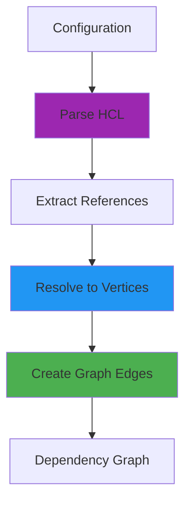
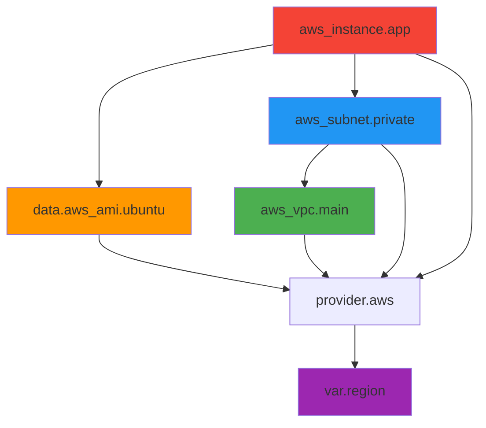

Dependency resolution is the process of analyzing configuration to discover relationships between resources, then encoding those relationships as graph edges.

## Overview

Dependency resolution happens in two phases:



**Phase 1: Static Analysis**
- Parse configuration into AST
- Extract all references from expressions
- Validate reference syntax

**Phase 2: Graph Construction**  
- Map references to graph vertices
- Create dependency edges
- Handle special dependency cases

## Reference Types

Terraform supports several reference forms:

### Resource References

```hcl
resource "aws_instance" "app" {
  ami           = data.aws_ami.ubuntu.id
  subnet_id     = aws_subnet.private.id
  security_groups = [
    aws_security_group.app.id,
    aws_security_group.common.id,
  ]
}
```

**Reference analysis:**
- `data.aws_ami.ubuntu.id` → data resource dependency
- `aws_subnet.private.id` → managed resource dependency  
- `aws_security_group.app.id` → managed resource dependency
- `aws_security_group.common.id` → managed resource dependency

### Variable References

```hcl
variable "instance_count" {
  type = number
}

resource "aws_instance" "web" {
  count = var.instance_count
  # ...
}
```

**Dependency:** `aws_instance.web` depends on variable `instance_count`

### Local Value References

```hcl
locals {
  common_tags = {
    Environment = "production"
  }
}

resource "aws_instance" "app" {
  tags = local.common_tags
}
```

**Dependency:** `aws_instance.app` depends on local value `common_tags`

### Module References

```hcl
module "vpc" {
  source = "./modules/vpc"
}

resource "aws_instance" "app" {
  subnet_id = module.vpc.private_subnet_id
}
```

**Dependency:** `aws_instance.app` depends on module `vpc` output

### Self References

```hcl
resource "aws_instance" "cluster" {
  count = 3
  
  user_data = templatefile("init.sh", {
    peer_ips = aws_instance.cluster[*].private_ip
  })
}
```

**Special handling:** Reference to own resource instances

See: `internal/terraform/validate_selfref.go`

## Reference Extraction

References are extracted from HCL expressions:

### Expression Analysis

```go
// internal/lang/references.go
func References(body hcl.Body) ([]*addrs.Reference, tfdiags.Diagnostics) {
    // Get all expression variables
    vars := body.Variables()
    
    refs := []*addrs.Reference{}
    for _, traversal := range vars {
        // Parse into structured address
        ref, diags := addrs.ParseRef(traversal)
        if diags.HasErrors() {
            continue
        }
        refs = append(refs, ref)
    }
    
    return refs, nil
}
```

### HCL Traversal

References start as HCL traversals:

```go
type Traversal []Traverser

type Traverser interface{}

// Root name
type TraverseRoot struct {
    Name string
}

// Attribute access (.attr)  
type TraverseAttr struct {
    Name string
}

// Index access [key]
type TraverseIndex struct {
    Key cty.Value
}
```

**Example traversal:**

```hcl
aws_instance.web[0].private_ip
```

↓ Parsed as:

```go
Traversal{
    TraverseRoot{Name: "aws_instance"},
    TraverseAttr{Name: "web"},
    TraverseIndex{Key: cty.NumberIntVal(0)},
    TraverseAttr{Name: "private_ip"},
}
```

### Address Parsing

Traversals are parsed into typed addresses:

```go
// internal/addrs/parse_ref.go
func ParseRef(traversal hcl.Traversal) (*Reference, tfdiags.Diagnostics) {
    // First element determines type
    root := traversal.RootName()
    
    switch root {
    case "var":
        return parseVarRef(traversal)
    case "local":
        return parseLocalRef(traversal)
    case "module":
        return parseModuleCallRef(traversal)
    case "data":
        return parseDataRef(traversal)
    case "resource":
        return parseResourceRef(traversal)
    default:
        // Implied resource reference
        return parseResourceRef(traversal)
    }
}
```

**Reference structure:**

```go
type Reference struct {
    Subject     Referenceable  // What is being referenced
    SourceRange hcl.Range      // Where in config
    Remaining   hcl.Traversal  // Remaining path
}

type Referenceable interface {
    referenceableSigil()
}

// Implementations:
type Resource
type ResourceInstance  
type ModuleCall
type InputVariable
type LocalValue
type OutputValue
```

See: `internal/addrs/referenceable.go`

## Reference Map

The `ReferenceMap` connects references to vertices:

```go
// internal/terraform/reference_map.go
type ReferenceMap struct {
    vertices []Vertex
    
    // Map from referenceable address to vertices
    references map[string][]Vertex
}

func NewReferenceMap(vertices []Vertex) *ReferenceMap {
    m := &ReferenceMap{
        vertices:   vertices,
        references: make(map[string][]Vertex),
    }
    
    // Build map from addresses to vertices
    for _, v := range vertices {
        referenceable, ok := v.(GraphNodeReferenceable)
        if !ok {
            continue
        }
        
        // Get all addresses this vertex can be referenced by
        addrs := referenceable.ReferenceableAddrs()
        for _, addr := range addrs {
            key := addr.String()
            m.references[key] = append(m.references[key], v)
        }
    }
    
    return m
}
```

### Looking Up References

```go
func (m *ReferenceMap) References(v Vertex) []Vertex {
    // Get references from this vertex
    referencer, ok := v.(GraphNodeReferencer)
    if !ok {
        return nil
    }
    
    refs := referencer.References()
    
    // Resolve each reference to vertices
    var targets []Vertex
    for _, ref := range refs {
        key := ref.Subject.String()
        targets = append(targets, m.references[key]...)
    }
    
    return targets
}
```

**Example:**

```hcl
resource "aws_instance" "app" {
  subnet_id = aws_subnet.private.id
}
```

1. Vertex `aws_instance.app` implements `GraphNodeReferencer`
2. Returns reference to `aws_subnet.private`  
3. Reference map looks up `"aws_subnet.private"`
4. Returns vertex for that resource

See: `internal/terraform/reference_map.go`

## ReferenceTransformer

The `ReferenceTransformer` creates graph edges:

```go
// internal/terraform/transform_reference.go:110
type ReferenceTransformer struct{}

func (t *ReferenceTransformer) Transform(g *Graph) error {
    // Build reference map
    vertices := g.Vertices()
    refMap := NewReferenceMap(vertices)
    
    // For each vertex that references others
    for _, v := range vertices {
        // Skip destroy nodes
        if _, ok := v.(GraphNodeDestroyer); ok {
            continue
        }
        
        // Get vertices this references
        parents := refMap.References(v)
        
        // Create dependency edges
        for _, parent := range parents {
            // Skip destroy nodes as parents
            if _, ok := parent.(GraphNodeDestroyer); ok {
                continue
            }
            
            // Skip inter-module-instance dependencies
            if !graphNodesAreResourceInstancesInDifferentInstancesOfSameModule(v, parent) {
                g.Connect(dag.BasicEdge(v, parent))
            }
        }
    }
    
    return nil
}
```

**Key behaviors:**

- **Destroy nodes ignored**: They rely on state, not references
- **Inter-module-instance blocked**: Prevents invalid dependencies
- **Edge direction**: From referencer to referenced

See: `internal/terraform/transform_reference.go:112`

## Special Dependency Cases

### Explicit Dependencies (depends_on)

Manual dependency declaration:

```hcl
resource "aws_instance" "app" {
  # ...
  
  depends_on = [
    aws_iam_role_policy.app,
  ]
}
```

**Processing:**

```go
type graphNodeDependsOn interface {
    DependsOn() []*addrs.Reference
}

func (n *NodePlannableResourceInstance) DependsOn() []*addrs.Reference {
    return n.Config.DependsOn
}
```

These references are treated identically to implicit references.

### Data Resource Dependencies

Data resources have special dependency handling:

```go
// internal/terraform/transform_reference.go:178
type attachDataResourceDependsOnTransformer struct{}

func (t attachDataResourceDependsOnTransformer) Transform(g *Graph) error {
    refMap := NewReferenceMap(g.Vertices())
    
    for _, v := range g.Vertices() {
        depender, ok := v.(graphNodeAttachDataResourceDependsOn)
        if !ok || depender.ResourceAddr().Mode != addrs.DataResourceMode {
            continue
        }
        
        // Transitively follow depends_on
        deps := make(depMap)
        collectDeps(depender, refMap, deps)
        
        // Attach to data resource  
        depList := make([]addrs.ConfigResource, 0, len(deps))
        for _, dep := range deps {
            depList = append(depList, dep)
        }
        depender.AttachDataResourceDependsOn(depList)
    }
}
```

**Purpose:** Data resources may need to wait for managed resources to apply.

See: `internal/terraform/transform_reference.go:178`

### Module Variable Dependencies

Module input variables are resolved in parent scope:

```go
type GraphNodeReferenceOutside interface {
    ReferenceOutside() (selfPath, referencePath addrs.Module)
}
```

**Example:**

```hcl
# Parent module
module "vpc" {
  source = "./vpc"
  
  cidr_block = var.network_cidr  # Resolved in parent
}
```

The module variable node implements `ReferenceOutside`:

```go
func (n *NodeModuleVariable) ReferenceOutside() (addrs.Module, addrs.Module) {
    // Variable belongs to child module
    selfPath := n.Addr.Module
    
    // But references are in parent module
    referencePath := selfPath.Parent()
    
    return selfPath, referencePath
}
```

See: `internal/terraform/transform_module_variable.go`

### Provider Dependencies

Resources automatically depend on their providers:

```go
// internal/terraform/transform_provider.go
type ProviderTransformer struct{}

func (t *ProviderTransformer) Transform(g *Graph) error {
    for _, v := range g.Vertices() {
        // Get provider requirement
        pv, ok := v.(GraphNodeProviderConsumer)
        if !ok {
            continue
        }
        
        providerAddr := pv.Provider()
        
        // Find provider vertex
        var providerVertex Vertex
        for _, v2 := range g.Vertices() {
            p, ok := v2.(GraphNodeProvider)
            if ok && p.ProviderAddr() == providerAddr {
                providerVertex = v2
                break
            }
        }
        
        if providerVertex != nil {
            // Resource depends on provider
            g.Connect(dag.BasicEdge(v, providerVertex))
        }
    }
}
```

**Ensures:** Providers initialize before resource operations.

See: `internal/terraform/transform_provider.go:39`

### Provisioner Dependencies

Provisioners depend on connections:

```hcl
resource "aws_instance" "app" {
  # ...
  
  connection {
    host = self.public_ip  # Self-reference
  }
  
  provisioner "remote-exec" {
    inline = [
      "echo ${aws_s3_bucket.assets.id}",  # External reference
    ]
  }
}
```

**Dependencies created:**
- Provisioner depends on resource (implicit)
- Provisioner depends on `aws_s3_bucket.assets` (from inline reference)

See: `internal/terraform/transform_provisioner.go`

## Dependency Graph Example

Given this configuration:

```hcl
variable "region" {
  default = "us-west-2"
}

data "aws_ami" "ubuntu" {
  # ...
}

resource "aws_vpc" "main" {
  cidr_block = "10.0.0.0/16"
}

resource "aws_subnet" "private" {
  vpc_id     = aws_vpc.main.id
  cidr_block = "10.0.1.0/24"
}

resource "aws_instance" "app" {
  ami       = data.aws_ami.ubuntu.id
  subnet_id = aws_subnet.private.id
}
```

The dependency graph:



**Execution order (one valid topological sort):**

1. `var.region`
2. `provider.aws`  
3. `data.aws_ami.ubuntu` and `aws_vpc.main` (parallel)
4. `aws_subnet.private`
5. `aws_instance.app`

## Reference Resolution Errors

### Undefined Reference

```hcl
resource "aws_instance" "app" {
  ami = aws_ami.missing.id  # Error: no such resource
}
```

**Error:**
```
Error: Reference to undeclared resource

A managed resource "aws_ami" "missing" has not been declared in the root module.
```

### Self-Reference in Count

```hcl
resource "aws_instance" "bad" {
  count = length(aws_instance.bad)  # Error: self-reference
}
```

**Error:**
```  
Error: Self-referential block

Configuration for aws_instance.bad depends on values from the same resource.
```

See: `internal/terraform/validate_selfref.go`

### Cycle Detection

```hcl
resource "aws_instance" "a" {
  user_data = aws_instance.b.id
}

resource "aws_instance" "b" {
  user_data = aws_instance.a.id
}
```

**Error:**
```
Error: Cycle

Cycle: aws_instance.a, aws_instance.b, aws_instance.a
```

Detected by graph validation.

### Cross-Module Instance Reference

```hcl
module "servers" {
  source = "./servers"
  count  = 3
}

resource "aws_lb_target" "app" {
  # Error: Can't reference specific module instance from outside
  target_id = module.servers[0].instance_id
}
```

Module references must use `module.servers` (all instances), not `module.servers[0]` (specific instance).

## Performance Considerations

### Reference Extraction

**Complexity:** O(E) where E is number of expressions

- Each expression analyzed once
- Traversal parsing is O(1) per reference
- No deep analysis required

### Reference Map Construction  

**Complexity:** O(V * R) where:
- V = number of vertices
- R = average referenceable addresses per vertex

Typically R is small (1-3), so approximately O(V).

### Reference Resolution

**Complexity:** O(V * D) where:
- V = number of vertices  
- D = average dependencies per vertex

### Optimization: Caching

Reference map caches address-to-vertex lookups:

```go
// Without cache: O(V) lookup per reference
for _, v := range vertices {
    if v.Addr() == targetAddr {
        return v
    }
}

// With cache: O(1) lookup per reference
return refMap.references[targetAddr.String()]
```

## Integration with Graph Builders

Reference transformer is used in all graph builders:

```go
// Plan graph
func (b *PlanGraphBuilder) Steps() []GraphTransformer {
    return []GraphTransformer{
        &ConfigTransformer{},       // Add resource vertices
        // ... other transforms
        &ReferenceTransformer{},    // Add dependency edges
        &TransitiveReductionTransformer{},
    }
}

// Apply graph  
func (b *ApplyGraphBuilder) Steps() []GraphTransformer {
    return []GraphTransformer{
        &DiffTransformer{},         // Add change vertices
        // ... other transforms
        &ReferenceTransformer{},    // Add dependency edges
    }
}
```

**Position matters:**

- Must run **after** vertex creation transforms
- Must run **before** transitive reduction
- Typically near end of transform pipeline

See: `internal/terraform/graph_builder_plan.go`

## Reference Scope and Namespacing

References are scoped to modules:

```hcl
# Root module
resource "aws_vpc" "main" {
  # ...
}

module "subnet" {
  source = "./subnet"
}

# Module: ./subnet/main.tf  
resource "aws_subnet" "private" {
  # References root module resource
  vpc_id = var.vpc_id  # NOT aws_vpc.main.id
}
```

**Namespace isolation:**

- Each module has its own namespace
- Resources reference within same module
- Cross-module via module outputs
- Variables connect modules

**Address representation:**

```go
type AbsResource struct {
    Module   ModuleInstance
    Resource Resource
}

// Example: module.vpc.aws_subnet.private
AbsResource{
    Module:   ModuleInstance{"vpc"},
    Resource: Resource{
        Mode: ManagedResourceMode,
        Type: "aws_subnet",  
        Name: "private",
    },
}
```

## Further Reading

<CardGroup cols={2}>
  <Card title="Graph Evaluation" icon="diagram-project" href="/architecture/graph-evaluation">
    How dependency graphs are executed
  </Card>
  <Card title="Modules Runtime" icon="cube" href="/architecture/modules-runtime">
    Complete graph building pipeline
  </Card>
</CardGroup>
