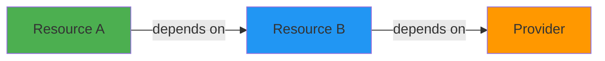
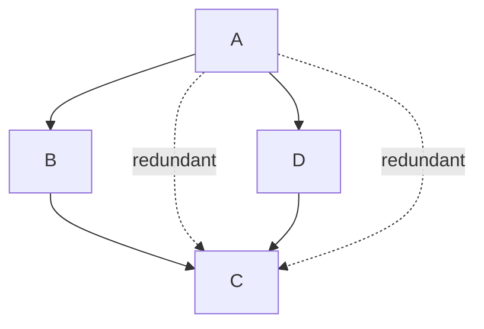
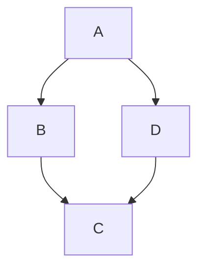
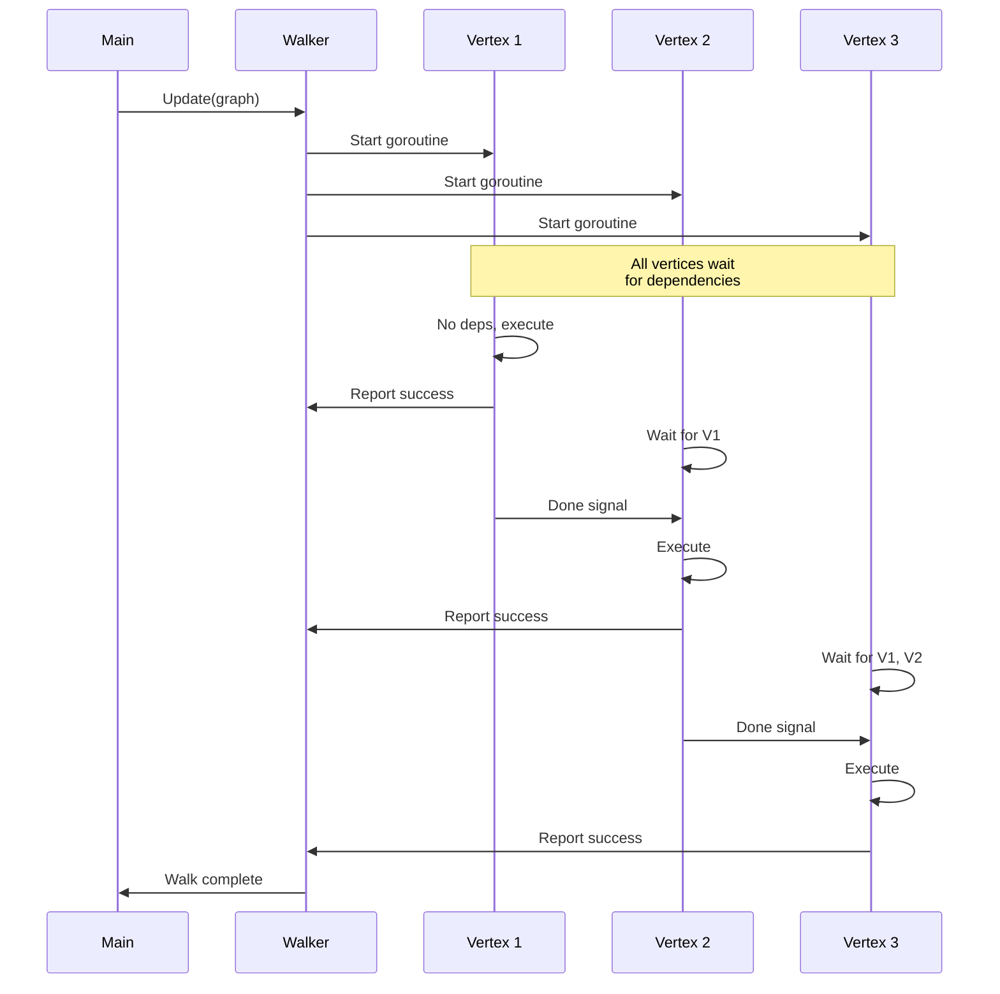
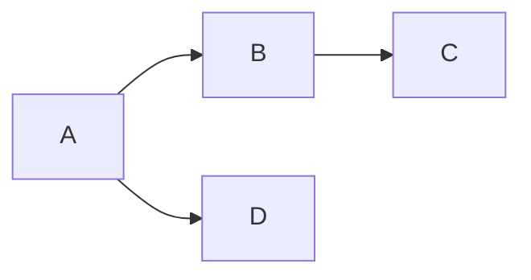
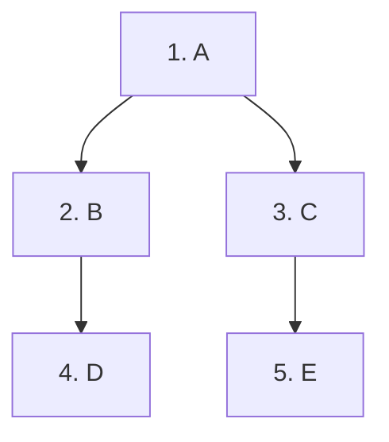
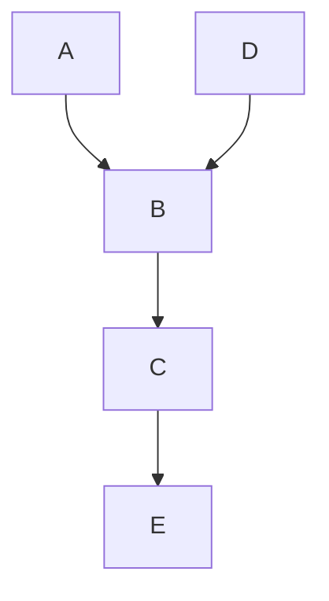

Terraform uses directed acyclic graphs (DAGs) to model dependencies and execute operations. This document covers the graph data structure, algorithms, and concurrent execution model.

## Graph Data Structure

Terraform's graph implementation is in `internal/dag`:

```go
// internal/dag/graph.go
type Graph struct {
    vertices Set
    edges    Set
    downEdges map[interface{}]Set  // vertex -> dependencies
    upEdges   map[interface{}]Set  // vertex -> dependents
}

type AcyclicGraph struct {
    Graph
}
```

### Vertices

**Vertices** represent operations:

```go
type Vertex interface{}

// Example vertex types
type NodePlannableResourceInstance struct {
    Addr   addrs.AbsResourceInstance
    Config *configs.Resource
}

type NodeApplyableProvider struct {
    Addr addrs.AbsProviderConfig
}
```

Any Go value can be a vertex. Common types include:
- Resource instances
- Providers
- Variables
- Outputs
- Module expansion nodes

### Edges

**Edges** represent "happens after" dependencies:

```go
type Edge interface {
    Source() Vertex
    Target() Vertex
}

type BasicEdge struct {
    source Vertex
    target Vertex
}

// Creates edge: dependent -> dependency
func BasicEdge(dependent, dependency Vertex) Edge
```

**Edge direction:**



Edge from A to B means "A depends on B" or "B happens before A".

### Graph Operations

<CodeGroup>
```go Adding Elements
g := &Graph{}

// Add vertices
g.Add(vertexA)
g.Add(vertexB)

// Add edge (A depends on B)
g.Connect(BasicEdge(vertexA, vertexB))
```

```go Querying
// Get all vertices
vertices := g.Vertices()

// Get dependencies of vertex
deps := g.DownEdges(vertex)

// Get dependents of vertex  
dependents := g.UpEdges(vertex)

// Check for vertex
has := g.HasVertex(vertex)
```

```go Modifying
// Remove vertex (and its edges)
g.Remove(vertex)

// Remove edge
g.RemoveEdge(edge)

// Add subgraph
g.Subsume(otherGraph)
```
</CodeGroup>

See: `internal/dag/graph.go`

## Acyclic Graph Requirements

Terraform graphs must be **acyclic**:

### Root Node

Every graph must have exactly one root:

```go
// internal/dag/dag.go:174
func (g *AcyclicGraph) Root() (Vertex, error) {
    roots := []Vertex{}
    for _, v := range g.Vertices() {
        if g.upEdgesNoCopy(v).Len() == 0 {
            roots = append(roots, v)
        }
    }
    
    if len(roots) > 1 {
        return nil, fmt.Errorf("multiple roots: %v", roots)
    }
    if len(roots) == 0 {
        return nil, fmt.Errorf("no roots found")
    }
    
    return roots[0], nil
}
```

**Complexity:** O(V)

### Cycle Detection  

Graphs are validated for cycles:

```go
// internal/dag/dag.go:229
func (g *AcyclicGraph) Validate() error {
    if _, err := g.Root(); err != nil {
        return err
    }
    
    cycles := g.Cycles()
    if len(cycles) > 0 {
        return fmt.Errorf("Cycle: %s", cycles)
    }
    
    // Check for self-references
    for _, e := range g.Edges() {
        if e.Source() == e.Target() {
            return fmt.Errorf("Self reference: %s", e.Source())
        }
    }
    
    return nil
}
```

**Example cycle error:**

```
Cycle: aws_instance.a, aws_security_group.b, aws_instance.a
```

See: `internal/dag/dag.go:229`

## Cycle Detection Algorithm

Terraform uses **Tarjan's strongly connected components** algorithm:

```go
// internal/dag/tarjan.go
func StronglyConnected(g *Graph) [][]Vertex {
    acct := sccAcct{
        NextIndex:   1,
        VertexIndex: make(map[Vertex]int),
    }
    
    for _, v := range g.Vertices() {
        if acct.VertexIndex[v] == 0 {
            stronglyConnected(&acct, g, v)
        }
    }
    
    return acct.SCC
}

func stronglyConnected(acct *sccAcct, g *Graph, v Vertex) int {
    // Assign index and push to stack
    index := acct.visit(v)
    minIdx := index
    
    // Visit all successors
    for _, target := range g.downEdgesNoCopy(v) {
        targetIdx := acct.VertexIndex[target]
        
        if targetIdx == 0 {
            // Recurse on unvisited
            minIdx = min(minIdx, stronglyConnected(acct, g, target))
        } else if acct.inStack(target) {
            // Back edge to vertex in stack
            minIdx = min(minIdx, targetIdx)
        }
    }
    
    // If this is a root, pop the SCC
    if index == minIdx {
        var scc []Vertex
        for {
            v2 := acct.pop()
            scc = append(scc, v2)
            if v2 == v {
                break
            }
        }
        acct.SCC = append(acct.SCC, scc)
    }
    
    return minIdx
}
```

**Algorithm properties:**

- **Time complexity**: O(V + E)
- **Space complexity**: O(V) for stack
- **Single pass**: Visits each vertex once
- **Finds all cycles**: Returns strongly connected components

**Strongly connected component** = group of vertices with paths to each other.

- Size 1 = no cycle
- Size > 1 = cycle

See: `internal/dag/tarjan.go`

## Transitive Reduction

Removes redundant edges while preserving reachability:

<Tabs>
<Tab title="Before Reduction">


A→C is redundant (A→B→C and A→D→C exist).
</Tab>

<Tab title="After Reduction">


Redundant edges removed. Reachability preserved.
</Tab>
</Tabs>

### Algorithm Implementation

```go
// internal/dag/dag.go:208
func (g *AcyclicGraph) TransitiveReduction() {
    // For each vertex u
    for _, u := range g.Vertices() {
        uTargets := g.downEdgesNoCopy(u)
        
        // DFS from each direct descendant v of u
        g.DepthFirstWalk(g.downEdgesNoCopy(u), func(v Vertex, d int) error {
            // Find vertices reachable from both u and v
            shared := uTargets.Intersection(g.downEdgesNoCopy(v))
            
            // Remove direct edges from u to those vertices
            for _, vPrime := range shared {
                g.RemoveEdge(BasicEdge(u, vPrime))
            }
            
            return nil
        })
    }
}
```

**Algorithm explanation:**

1. For each vertex **u**
2. For each direct descendant **v** of **u**  
3. Find vertices reachable from **v**
4. Remove direct edges from **u** to those vertices

**Why it works:**

If u→v and v→w both exist, then u→w is redundant (path exists via v).

**Complexity:** O(V(V+E)) or O(VE)

See: `internal/dag/dag.go:208`

## Graph Walk Algorithm

The `Walker` executes vertices in parallel:

```go
// internal/dag/walk.go:39
type Walker struct {
    Callback WalkFunc
    Reverse  bool
    
    vertices  Set
    edges     Set
    vertexMap map[Vertex]*walkerVertex
    diagsMap  map[Vertex]tfdiags.Diagnostics
}

type walkerVertex struct {
    DoneCh       chan struct{}
    CancelCh     chan struct{}
    DepsCh       chan bool
    DepsUpdateCh chan struct{}
    deps         map[Vertex]chan struct{}
}
```

### Walk Initialization

```go
func (w *Walker) Update(g *AcyclicGraph) {
    newVerts := g.Vertices().Difference(w.vertices)
    newEdges := g.Edges().Difference(w.edges)
    
    // Create walkerVertex for each new vertex
    for _, v := range newVerts {
        info := &walkerVertex{
            DoneCh:   make(chan struct{}),
            CancelCh: make(chan struct{}),
            deps:     make(map[Vertex]chan struct{}),
        }
        w.vertexMap[v] = info
        
        // Start goroutine for this vertex
        go w.walkVertex(v, info)
    }
    
    // Update dependency tracking for new edges
    for _, edge := range newEdges {
        waiter := edge.Target()     // Depends on
        dep := edge.Source()        // Dependency
        
        waiterInfo := w.vertexMap[waiter]
        depInfo := w.vertexMap[dep]
        
        // Waiter tracks dependency's done channel
        waiterInfo.deps[dep] = depInfo.DoneCh
    }
}
```

### Vertex Execution

```go
func (w *Walker) walkVertex(v Vertex, info *walkerVertex) {
    defer w.wait.Done()
    defer close(info.DoneCh)
    
    // Wait for all dependencies
    var depsSuccess bool
    depsCh := make(chan bool, 1)
    depsCh <- true  // Initial value
    
    for {
        select {
        case <-info.CancelCh:
            return  // Cancelled
            
        case depsSuccess = <-depsCh:
            depsCh = nil  // Dependencies satisfied
            
        case <-depsUpdateCh:
            // New dependencies added, loop again
        }
        
        // Load latest dependencies
        info.DepsLock.Lock()
        if info.DepsCh != nil {
            depsCh = info.DepsCh
            info.DepsCh = nil
        }
        depsUpdateCh = info.DepsUpdateCh
        info.DepsLock.Unlock()
        
        if depsCh == nil {
            break  // All dependencies satisfied
        }
    }
    
    // Execute callback if dependencies succeeded
    var diags tfdiags.Diagnostics
    if depsSuccess {
        diags = w.Callback(v)
    } else {
        diags = diags.Append(errors.New("upstream failed"))
    }
    
    // Record diagnostics
    w.diagsLock.Lock()
    w.diagsMap[v] = diags
    if !depsSuccess {
        w.upstreamFailed[v] = struct{}{}
    }
    w.diagsLock.Unlock()
}
```

See: `internal/dag/walk.go:332`

### Dependency Waiting

```go
func (w *Walker) waitDeps(
    v Vertex,
    deps map[Vertex]<-chan struct{},
    doneCh chan<- bool,
    cancelCh <-chan struct{},
) {
    // Wait for each dependency
    for dep, depCh := range deps {
        select {
        case <-depCh:
            // Dependency completed
            
        case <-cancelCh:
            doneCh <- false  // Cancelled
            return
            
        case <-time.After(5 * time.Second):
            log.Printf("[TRACE] %s waiting for %s", v, dep)
        }
    }
    
    // Check if any dependency failed
    w.diagsLock.Lock()
    defer w.diagsLock.Unlock()
    
    for dep := range deps {
        if w.diagsMap[dep].HasErrors() {
            doneCh <- false  // Dependency failed
            return
        }
    }
    
    doneCh <- true  // All dependencies succeeded
}
```

See: `internal/dag/walk.go:419`

### Walk Flow



## Topological Sort

Produces a linear ordering respecting dependencies:

```go
// internal/dag/dag.go:299
func (g *AcyclicGraph) TopologicalOrder() []Vertex {
    sorted := []Vertex{}
    tmp := map[Vertex]bool{}   // Currently visiting
    perm := map[Vertex]bool{}  // Completed
    
    var visit func(Vertex)
    visit = func(v Vertex) {
        if perm[v] {
            return  // Already visited
        }
        if tmp[v] {
            panic("cycle found")  // Should not happen
        }
        
        tmp[v] = true
        
        // Visit all dependencies first  
        for _, dep := range g.downEdgesNoCopy(v) {
            visit(dep)
        }
        
        tmp[v] = false
        perm[v] = true
        sorted = append(sorted, v)
    }
    
    for _, v := range g.Vertices() {
        visit(v)
    }
    
    return sorted
}
```

**Result:** Dependencies appear before dependents in the list.



Possible topological orders:
- `[C, B, D, A]`
- `[C, D, B, A]`
- `[D, C, B, A]`

All valid as long as dependencies come first.

**Complexity:** O(V + E)

See: `internal/dag/dag.go:299`

## Graph Traversal Methods

### Depth-First Walk

```go
func (g *AcyclicGraph) DepthFirstWalk(
    start Set,
    f DepthWalkFunc,
) error {
    return g.walk(depthFirst|downOrder, false, start, f)
}
```

Visits vertices depth-first:


Order: A, B, D, C, E (completes branches before moving to next)

### Breadth-First Walk

```go  
func (g *AcyclicGraph) BreadthFirstWalk(
    start Set,
    f DepthWalkFunc,
) error {
    return g.walk(breadthFirst|downOrder, false, start, f)
}
```

Visits vertices level-by-level:



Order: A, B, C, D, E (completes each level before next)

### Walk Implementation

```go
func (g *AcyclicGraph) walk(
    order walkType,
    test bool,
    start Set,
    f DepthWalkFunc,
) error {
    seen := make(map[Vertex]struct{})
    frontier := []vertexAtDepth{}
    
    for _, v := range start {
        frontier = append(frontier, vertexAtDepth{v, 0})
    }
    
    for len(frontier) > 0 {
        var current vertexAtDepth
        
        if order&depthFirst != 0 {
            // Pop from end (stack)
            current = frontier[len(frontier)-1]
            frontier = frontier[:len(frontier)-1]
        } else {
            // Pop from beginning (queue)
            current = frontier[0]
            frontier = frontier[1:]
        }
        
        if _, ok := seen[current.Vertex]; ok {
            continue
        }
        seen[current.Vertex] = struct{}{}
        
        // Visit vertex
        if err := f(current.Vertex, current.Depth); err != nil {
            return err
        }
        
        // Add descendants to frontier
        edges := g.downEdgesNoCopy(current.Vertex)
        for _, v := range edges {
            frontier = append(frontier, vertexAtDepth{v, current.Depth + 1})
        }
    }
    
    return nil
}
```

See: `internal/dag/dag.go:405`

## Ancestors and Descendants

Utility methods for graph queries:

```go
// Get all ancestors (dependencies, transitively)
func (g *AcyclicGraph) Ancestors(vs ...Vertex) Set {
    s := make(Set)
    start := make(Set)
    
    for _, v := range vs {
        for _, dep := range g.downEdgesNoCopy(v) {
            start.Add(dep)
        }
    }
    
    g.DepthFirstWalk(start, func(v Vertex, d int) error {
        s.Add(v)
        return nil
    })
    
    return s
}

// Get all descendants (dependents, transitively)  
func (g *AcyclicGraph) Descendants(v Vertex) Set {
    s := make(Set)
    start := make(Set)
    
    for _, dep := range g.upEdgesNoCopy(v) {
        start.Add(dep)
    }
    
    g.ReverseDepthFirstWalk(start, func(v Vertex, d int) error {
        s.Add(v)
        return nil
    })
    
    return s
}
```

**Example:**



- `Ancestors(A)` = {B, C, E}
- `Descendants(E)` = {C, B, A, D}

See: `internal/dag/dag.go:33`

## Performance Characteristics

### Time Complexity

| Operation | Complexity | Notes |
|-----------|------------|-------|
| Add vertex | O(1) | Hash map insert |
| Add edge | O(1) | Set operations |
| Remove vertex | O(E) | Remove all edges |
| Validate | O(V + E) | Tarjan's algorithm |
| Transitive reduction | O(V(V+E)) | DFS per vertex |
| Topological sort | O(V + E) | DFS-based |
| Walk | O(V + E) | Visit each vertex/edge |
| Ancestors/Descendants | O(V + E) | DFS traversal |

### Space Complexity

| Structure | Complexity | Description |
|-----------|------------|-------------|
| Graph | O(V + E) | Vertices + edges |
| Walker | O(V) | Per-vertex state |
| Tarjan | O(V) | Stack + indices |

### Parallelism

The walker creates:
- **V goroutines** for vertex execution
- **V goroutines** for dependency waiting
- **Total: 2V goroutines**

Concurrency limited by:
- Graph dependencies (natural constraint)
- Parallelism semaphore (default: 10)

## Further Reading

<CardGroup cols={2}>
  <Card title="Dependency Resolution" icon="link" href="/architecture/dependency-resolution">
    How references become graph edges
  </Card>
  <Card title="Modules Runtime" icon="cube" href="/architecture/modules-runtime">
    Graph usage in module execution
  </Card>
</CardGroup>
