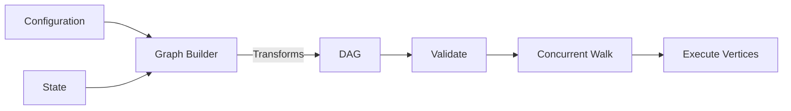
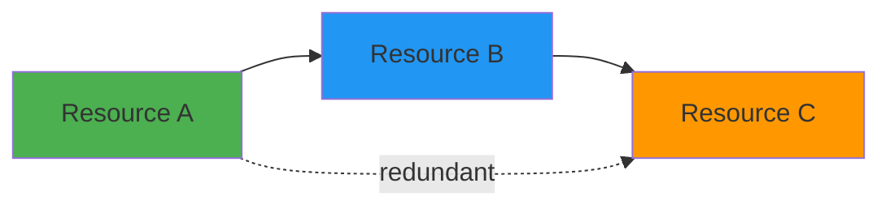
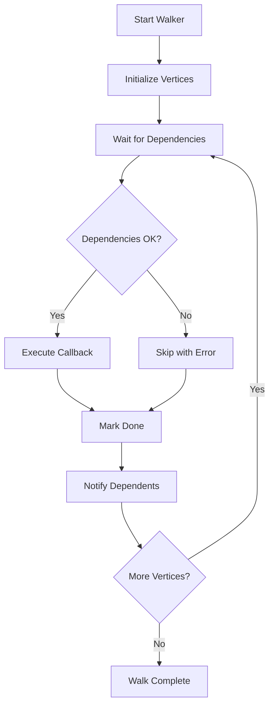
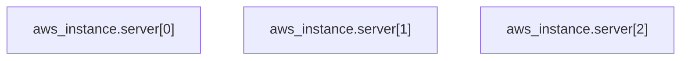
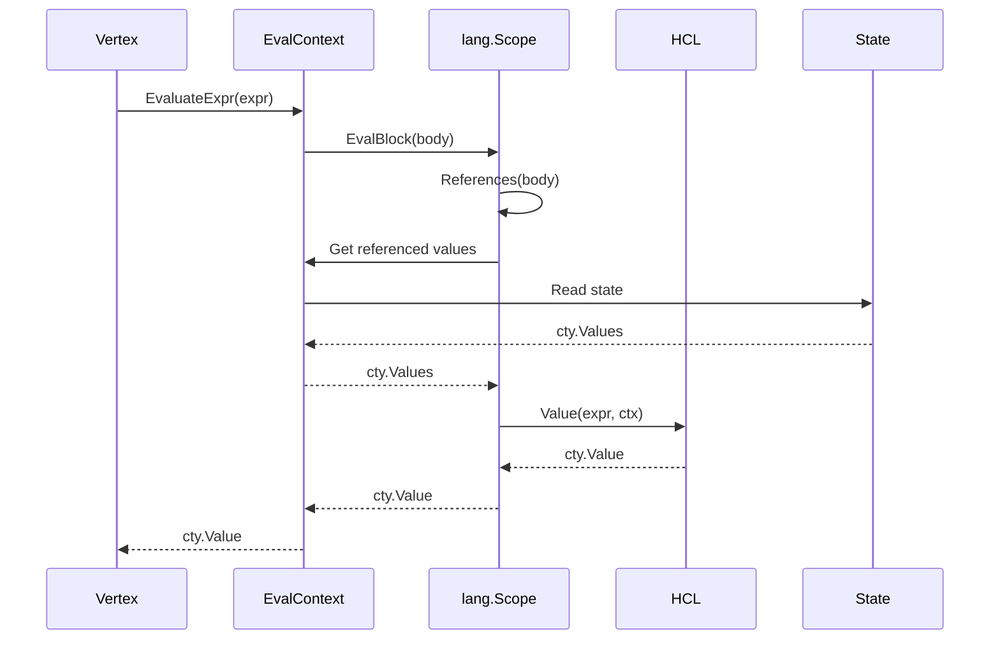

The modules runtime is Terraform's core execution engine for evaluating modules. It uses an explicit graph-based model where all operations are represented as vertices in a directed acyclic graph (DAG).

## Execution Model

The modules runtime follows a **build graph, walk graph** pattern:



### Graph Construction

Each operation builds a graph through a pipeline of transforms:

<CodeGroup>
```go Plan Graph Builder
// internal/terraform/graph_builder_plan.go
type PlanGraphBuilder struct {
    Config          *configs.Config
    State           *states.State
    Plugins         *contextPlugins
    Targets         []addrs.Targetable
    ForceReplace    []addrs.AbsResourceInstance
    // ...
}

func (b *PlanGraphBuilder) Steps() []GraphTransformer {
    return []GraphTransformer{
        &ConfigTransformer{},
        &StateTransformer{},
        &AttachResourceConfigTransformer{},
        &ReferenceTransformer{},
        &ProviderTransformer{},
        &TransitiveReductionTransformer{},
        // ... many more
    }
}
```

```go Apply Graph Builder  
// internal/terraform/graph_builder_apply.go
type ApplyGraphBuilder struct {
    Plan     *plans.Plan
    State    *states.State
    Plugins  *contextPlugins
    // ...
}

func (b *ApplyGraphBuilder) Steps() []GraphTransformer {
    return []GraphTransformer{
        &DiffTransformer{},        // From plan
        &StateTransformer{},       // From state
        &ProviderTransformer{},
        &ReferenceTransformer{},
        // ... apply-specific transforms
    }
}
```
</CodeGroup>

### Key Graph Transforms

#### ConfigTransformer

Creates a vertex for each `resource` block in configuration.

```go
// internal/terraform/transform_config.go
type ConfigTransformer struct {
    Config *configs.Config
}

func (t *ConfigTransformer) Transform(g *Graph) error {
    // For each resource in config
    for _, r := range module.Resources {
        // Create a graph node
        node := &NodePlannableResource{
            Addr:   r.Addr(),
            Config: r,
        }
        g.Add(node)
    }
}
```

#### StateTransformer

Creates vertices for resource instances currently tracked in state.

```go
// internal/terraform/transform_state.go
type StateTransformer struct {
    State *states.State
}

func (t *StateTransformer) Transform(g *Graph) error {
    // For each resource instance in state
    for _, rs := range state.Resources() {
        for key, is := range rs.Instances {
            node := &NodeAbstractResourceInstance{
                Addr: rs.Addr.Instance(key),
            }
            g.Add(node)
        }
    }
}
```

See: `internal/terraform/transform_state.go`

#### ReferenceTransformer

Analyzes references between resources and creates dependency edges.

```go
// internal/terraform/transform_reference.go
type ReferenceTransformer struct{}

func (t *ReferenceTransformer) Transform(g *Graph) error {
    // Build reference map
    m := NewReferenceMap(g.Vertices())
    
    // For each vertex that references others
    for _, v := range g.Vertices() {
        parents := m.References(v)
        for _, parent := range parents {
            // Add dependency edge: v depends on parent
            g.Connect(dag.BasicEdge(v, parent))
        }
    }
}
```

**Reference resolution:**

1. Extract all `hcl.Traversal` from expressions
2. Parse into `addrs.Reference` objects
3. Map references to graph vertices
4. Create edges from referencing vertex to referenced vertex

See: `internal/terraform/transform_reference.go:112`

#### ProviderTransformer

Associates each resource with its provider and ensures providers initialize first.

```go
// internal/terraform/transform_provider.go
func (t *ProviderTransformer) Transform(g *Graph) error {
    // For each resource vertex
    for _, v := range g.Vertices() {
        // Determine which provider it needs
        providerAddr := v.ProviderRequirement()
        
        // Find or create provider vertex
        providerNode := getOrCreateProvider(g, providerAddr)
        
        // Resource depends on provider
        g.Connect(dag.BasicEdge(v, providerNode))
    }
}
```

See: `internal/terraform/transform_provider.go:39`

#### TransitiveReductionTransformer

Removes redundant edges while preserving reachability.



If A→B→C and A→C both exist, the A→C edge is redundant and can be removed.

```go
// internal/dag/dag.go:208
func (g *AcyclicGraph) TransitiveReduction() {
    for _, u := range g.Vertices() {
        uTargets := g.downEdgesNoCopy(u)
        
        // DFS from each direct descendant
        g.DepthFirstWalk(g.downEdgesNoCopy(u), func(v Vertex, d int) error {
            // Remove edges to vertices reachable via v
            shared := uTargets.Intersection(g.downEdgesNoCopy(v))
            for _, vPrime := range shared {
                g.RemoveEdge(BasicEdge(u, vPrime))
            }
            return nil
        })
    }
}
```

**Complexity:** O(V(V+E)) or O(VE)

### Graph Validation

After construction, graphs must be validated:

```go
// internal/dag/dag.go:229
func (g *AcyclicGraph) Validate() error {
    // Must have exactly one root
    if _, err := g.Root(); err != nil {
        return err
    }
    
    // Detect cycles using Tarjan's algorithm
    cycles := g.Cycles()
    if len(cycles) > 0 {
        return fmt.Errorf("Cycle: %s", cycles)
    }
    
    // No self-references
    for _, e := range g.Edges() {
        if e.Source() == e.Target() {
            return fmt.Errorf("Self reference: %s", e.Source())
        }
    }
}
```

Cycle detection uses **Tarjan's strongly connected components** algorithm:

See: `internal/dag/tarjan.go`

## Graph Walk

The `Walker` executes vertices concurrently while respecting dependencies:

```go
// internal/dag/walk.go
type Walker struct {
    Callback WalkFunc
    Reverse  bool
    
    vertices   Set
    edges      Set
    vertexMap  map[Vertex]*walkerVertex
    diagsMap   map[Vertex]tfdiags.Diagnostics
}

type walkerVertex struct {
    DoneCh       chan struct{}     // Closed when complete
    CancelCh     chan struct{}     // Closed to cancel
    DepsCh       chan bool         // Receives dependency status
    DepsUpdateCh chan struct{}     // Notifies of new dependencies
    deps         map[Vertex]chan struct{}
}
```

### Walk Algorithm



**Implementation details:**

1. **Per-vertex goroutines**: Each vertex has a goroutine waiting on its dependencies
2. **Dependency tracking**: Each vertex tracks channels from its dependencies  
3. **Dynamic updates**: Graph can be updated during walk via `Update()`
4. **Error propagation**: Errors cause dependent vertices to skip execution
5. **Concurrent-safe**: Uses mutexes to protect shared diagnostics map

See: `internal/dag/walk.go:332`

### Vertex Execution

The walk callback executes each vertex:

```go
// internal/terraform/graph.go:46
func (g *Graph) Walk(walker GraphWalker) tfdiags.Diagnostics {
    walkFn := func(v dag.Vertex) tfdiags.Diagnostics {
        // Determine evaluation context for this vertex
        vertexCtx := determineContext(v, walker)
        
        // Execute the vertex
        if ev, ok := v.(GraphNodeExecutable); ok {
            diags = walker.Execute(vertexCtx, ev)
        }
        
        // Dynamically expand if needed (count/for_each)
        if ev, ok := v.(GraphNodeDynamicExpandable); ok {
            subGraph := ev.DynamicExpand(vertexCtx)
            diags = subGraph.Walk(walker)
        }
    }
    
    return g.AcyclicGraph.Walk(walkFn)
}
```

## Evaluation Context

The `EvalContext` provides shared state during execution:

```go
// internal/terraform/eval_context.go
type EvalContext interface {
    // Access to providers
    Provider(addrs.AbsProviderConfig) providers.Interface
    ProviderSchema(addrs.AbsProviderConfig) *ProviderSchema
    
    // Access to state
    State() *states.SyncState
    RefreshState() *states.SyncState
    PrevRunState() *states.SyncState
    
    // Access to plans
    Changes() *plans.ChangesSync
    
    // Expression evaluation
    EvaluateExpr(hcl.Expression, cty.Type) (cty.Value, tfdiags.Diagnostics)
}
```

**Implementations:**

- `BuiltinEvalContext` - Production implementation with full functionality
- `MockEvalContext` - Test implementation

The context is scoped per-module via `EnterPath()`:

```go
func (w *ContextGraphWalker) EnterPath(path addrs.ModuleInstance) EvalContext {
    return &BuiltinEvalContext{
        PathValue:           path,
        Plugins:             w.Context.plugins,
        Hooks:               w.Context.hooks,
        // ... module-specific state
    }
}
```

## Dynamic Expansion

Resources with `count` or `for_each` expand dynamically:

<Tabs>
<Tab title="Initial Graph">
```mermaid
graph TD
    R["resource \"aws_instance\" \"server\" {<br/>  count = 3<br/>}"]
```

Single vertex for the resource block.
</Tab>

<Tab title="After Expansion">


Three vertices, one per instance.
</Tab>
</Tabs>

```go
// internal/terraform/node_resource_plan.go
func (n *NodePlannableResource) DynamicExpand(ctx EvalContext) (*Graph, error) {
    // Evaluate count or for_each
    count := evaluateCount(ctx, n.Config.Count)
    
    // Build subgraph with one vertex per instance
    g := &Graph{}
    for i := 0; i < count; i++ {
        g.Add(&NodePlannableResourceInstance{
            Addr: n.Addr.Instance(addrs.IntKey(i)),
        })
    }
    return g, nil
}
```

The sub-graph:
- Has its own root node
- Is walked using the same algorithm
- Returns diagnostics to parent walk

See: `internal/terraform/transform_expand.go`

## Expression Evaluation Flow

Evaluating a resource configuration:



**Steps:**

1. **Analyze** - Extract references from expressions
2. **Resolve** - Look up each reference in state/config
3. **Build context** - Create `hcl.EvalContext` with values
4. **Evaluate** - HCL evaluates expression
5. **Return** - Result flows back to vertex

See: `internal/lang/eval.go`

## Concurrent State Access

Multiple vertices may access state concurrently:

```go
// internal/states/sync.go
type SyncState struct {
    mu    sync.RWMutex
    state *State
}

func (s *SyncState) Lock()   { s.mu.Lock() }
func (s *SyncState) Unlock() { s.mu.Unlock() }

func (s *SyncState) Resource(addr addrs.AbsResource) *ResourceState {
    s.mu.RLock()
    defer s.mu.RUnlock()
    return s.state.Resource(addr)
}
```

This ensures:
- **Read safety**: Multiple concurrent reads are safe
- **Write safety**: Writes are exclusive
- **Consistency**: State snapshots are consistent

## Performance Characteristics

### Graph Construction

- **Complexity**: O(V + E + T*E) where T is number of transforms
- **Bottlenecks**: ReferenceTransformer (O(V*R) where R is references per vertex)
- **Optimization**: Reference map caches lookups

### Graph Walk  

- **Parallelism**: Up to `parallelism` vertices execute concurrently (default 10)
- **Overhead**: V*2 goroutines created regardless of parallelism
- **Scheduling**: Automatic based on dependencies

### Memory Usage

- **Graph**: O(V + E) for vertices and edges
- **Walker state**: O(V) for per-vertex tracking
- **Evaluation**: O(V) for cached expression results

## Comparison with Stacks Runtime

The modules runtime differs from the newer stacks runtime:

| Aspect | Modules Runtime | Stacks Runtime |
|--------|----------------|----------------|
| **Graph** | Explicit, pre-built | Implicit, dynamic data flow |
| **Concurrency** | Walker-controlled | Promise-based |
| **State** | Shared mutable `EvalContext` | Immutable method calls |
| **Scheduling** | Static dependency graph | Dynamic call graph |
| **Expansion** | Graph-based sub-graphs | Lazy instance creation |

See: [Stacks Runtime](/architecture/stacks-runtime)

## Further Reading

<CardGroup cols={2}>
  <Card title="Graph Evaluation" icon="diagram-project" href="/architecture/graph-evaluation">
    Deep dive into graph algorithms
  </Card>
  <Card title="Dependency Resolution" icon="link" href="/architecture/dependency-resolution">
    How references become edges
  </Card>
</CardGroup>
