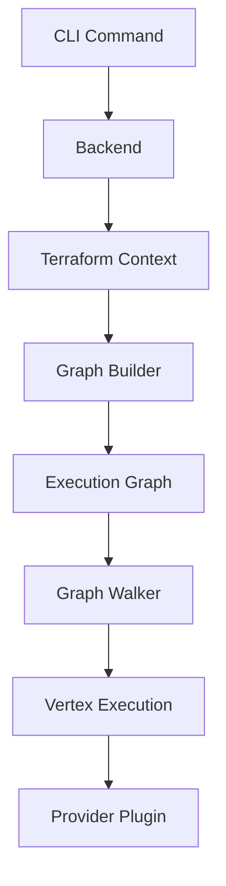

Terraform Core is a sophisticated system that orchestrates infrastructure changes through a graph-based execution model. This document provides a high-level overview of how Terraform's components work together to transform configuration into infrastructure.

## Request Flow

When you run a Terraform command like `terraform plan` or `terraform apply`, the request flows through several layers:



### CLI Layer

The CLI layer (`internal/command/`) handles:
- Parsing command-line arguments and flags
- Reading environment variables
- Constructing a `backendrun.Operation` that describes the action to take
- Passing the operation to the selected backend

Each command maps to a specific implementation in the `command` package (see `commands.go` in the repository root).

### Backend Layer

Backends (`internal/backend/`) determine where Terraform stores its state snapshots. The `local` backend also executes operations on behalf of most other backends:

- Retrieves current state using a **state manager** (`internal/states/statemgr`)
- Loads and validates configuration using the **config loader** (`internal/configs/configload`)
- Constructs a `terraform.Context` for execution
- Calls the appropriate context method (`Plan`, `Apply`, etc.)

Remote backends like HCP Terraform handle operations remotely rather than locally.

### Configuration Loading

The configuration loader (`internal/configs/configload.Loader`):

1. Takes a root module path as input
2. Recursively loads all child modules
3. Produces a `configs.Config` representing the entire configuration tree

Configuration is parsed from HCL files into model types in `internal/configs`. Some parts remain as `hcl.Body` and `hcl.Expression` for later evaluation during graph walk.

## Core Architecture Components

### Terraform Context

The `terraform.Context` (`internal/terraform/context.go`) is the main orchestrator:

```go
type Context struct {
    meta            *ContextMeta
    plugins         *contextPlugins
    hooks           []Hook
    parallelSem     Semaphore
    // ...
}
```

It manages:
- **Plugin instances** (providers and provisioners)
- **Hooks** for progress reporting
- **Parallelism** controls via semaphores
- **Execution state** through run contexts

The context provides methods for each major operation:
- `Plan()` - Creates an execution plan
- `Apply()` - Applies changes from a plan
- `Validate()` - Validates configuration
- `Refresh()` - Updates state from real infrastructure

### Graph-Based Execution

Terraform uses directed acyclic graphs (DAGs) to model dependencies and determine execution order:

<CodeGroup>
```go internal/terraform/graph.go
type Graph struct {
    dag.AcyclicGraph
    Path addrs.ModuleInstance
}
```

```go internal/dag/dag.go
type AcyclicGraph struct {
    Graph
}
```
</CodeGroup>

**Key concepts:**

- **Vertices** represent operations (resource instances, providers, variables, etc.)
- **Edges** represent "happens after" dependencies
- **Graph builders** construct graphs using transforms
- **Graph walkers** execute vertices in dependency order

### Graph Transforms

Graphs are built through a series of **transforms** (`GraphTransformer` interface):

- `ConfigTransformer` - Creates vertices for `resource` blocks
- `StateTransformer` - Creates vertices for resources in state
- `ReferenceTransformer` - Adds edges based on configuration references
- `ProviderTransformer` - Associates resources with providers
- `TransitiveReduction` - Removes redundant edges

Each operation (plan, apply, destroy) uses a different graph builder with a different set of transforms.

See: `internal/terraform/graph_builder_plan.go`, `internal/terraform/graph_builder_apply.go`

### Graph Walk

The graph walk (`internal/dag/walk.go`) visits vertices in parallel while respecting dependencies:

```go
type Walker struct {
    Callback WalkFunc
    Reverse  bool
    // ...
}
```

**Walk algorithm:**

1. Starts from vertices with no dependencies
2. Executes multiple vertices concurrently when possible
3. Waits for dependencies before executing dependent vertices
4. Collects diagnostics from all executions
5. Halts if any vertex returns errors

The walker creates `V*2` goroutines (one per vertex, one dependency waiter per vertex) for maximum parallelism.

### Vertex Execution

During the walk, each vertex that implements `GraphNodeExecutable` has its `Execute` method called:

<CodeGroup>
```go Plan Vertex
// NodePlannableResourceInstance.Execute
func (n *NodePlannableResourceInstance) Execute(ctx EvalContext, op walkOperation) tfdiags.Diagnostics {
    // Retrieves provider
    // Evaluates configuration expressions
    // Calls provider's PlanResourceChange
    // Saves the plan
}
```

```go Apply Vertex
// NodeApplyableResourceInstance.Execute  
func (n *NodeApplyableResourceInstance) Execute(ctx EvalContext, op walkOperation) tfdiags.Diagnostics {
    // Retrieves planned change
    // Calls provider's ApplyResourceChange
    // Updates state
}
```
</CodeGroup>

Execution steps typically involve:
1. Retrieving providers from `EvalContext`
2. Reading current state
3. Evaluating configuration expressions
4. Calling provider plugin methods
5. Updating plan or state

See: `internal/terraform/node_resource_plan_instance.go:68`

### Dynamic Expansion

Some vertices expand into **sub-graphs** after evaluation:

- Resources with `count` or `for_each` initially have one vertex per `resource` block
- After evaluating the count/for_each expression, the vertex creates a sub-graph with one vertex per instance
- The sub-graph is walked using the same algorithm

Vertices implementing `GraphNodeDynamicExpandable` trigger this behavior.

## Expression Evaluation

Configuration expressions are evaluated during vertex execution:

1. **Analyze** expressions to find references (`lang.References`)
2. **Retrieve** values for referenced objects from state
3. **Prepare** function table with built-in functions
4. **Evaluate** using HCL's evaluation engine

This produces `cty.Value` objects that are passed to providers.

See: `internal/lang/eval.go`

## Plugin Protocol

Terraform communicates with provider plugins via gRPC:

- Plugins are separate processes launched by Terraform
- Communication uses protocol buffers (`.proto` definitions)
- Values are serialized using MessagePack or JSON
- Current protocol versions: 5.x and 6.x

See: [Plugin Protocol](/architecture/plugin-protocol)

## State Management

State managers (`internal/states/statemgr`) handle state persistence:

- `statemgr.Filesystem` - Local `terraform.tfstate` files
- Remote state implementations - Cloud storage backends
- All implement `statemgr.Full` interface
- State is represented as `states.State` objects

State is locked during operations to prevent concurrent modifications.

## Concurrency and Synchronization

Terraform uses several concurrency primitives:

- **Semaphores** limit parallelism (default: 10 concurrent operations)
- **Mutexes** protect shared state via `states.SyncState`
- **Graph walk** automatically parallelizes independent operations
- **Hooks** are called synchronously during vertex execution

## Architecture Principles

### Separation of Concerns

- **Configuration** is separate from **state**
- **Planning** is separate from **applying**
- **Graph building** is separate from **graph walking**
- **Core** is separate from **providers**

### Deterministic Execution

While the graph walk is concurrent:
- Dependencies ensure correct ordering
- Same configuration + state → same plan
- Providers must be deterministic in planning

### Extensibility

The plugin model allows:
- Custom providers for any API
- Language-agnostic plugin development
- Version negotiation between core and plugins

## Further Reading

<CardGroup cols={2}>
  <Card title="Modules Runtime" icon="cube" href="/architecture/modules-runtime">
    Deep dive into traditional module execution
  </Card>
  <Card title="Stacks Runtime" icon="layer-group" href="/architecture/stacks-runtime">
    New orchestration layer for stacks
  </Card>
  <Card title="Plugin Protocol" icon="plug" href="/architecture/plugin-protocol">
    Provider communication specifications
  </Card>
  <Card title="Resource Lifecycle" icon="arrows-spin" href="/architecture/resource-lifecycle">
    How resources are created, updated, destroyed
  </Card>
</CardGroup>
