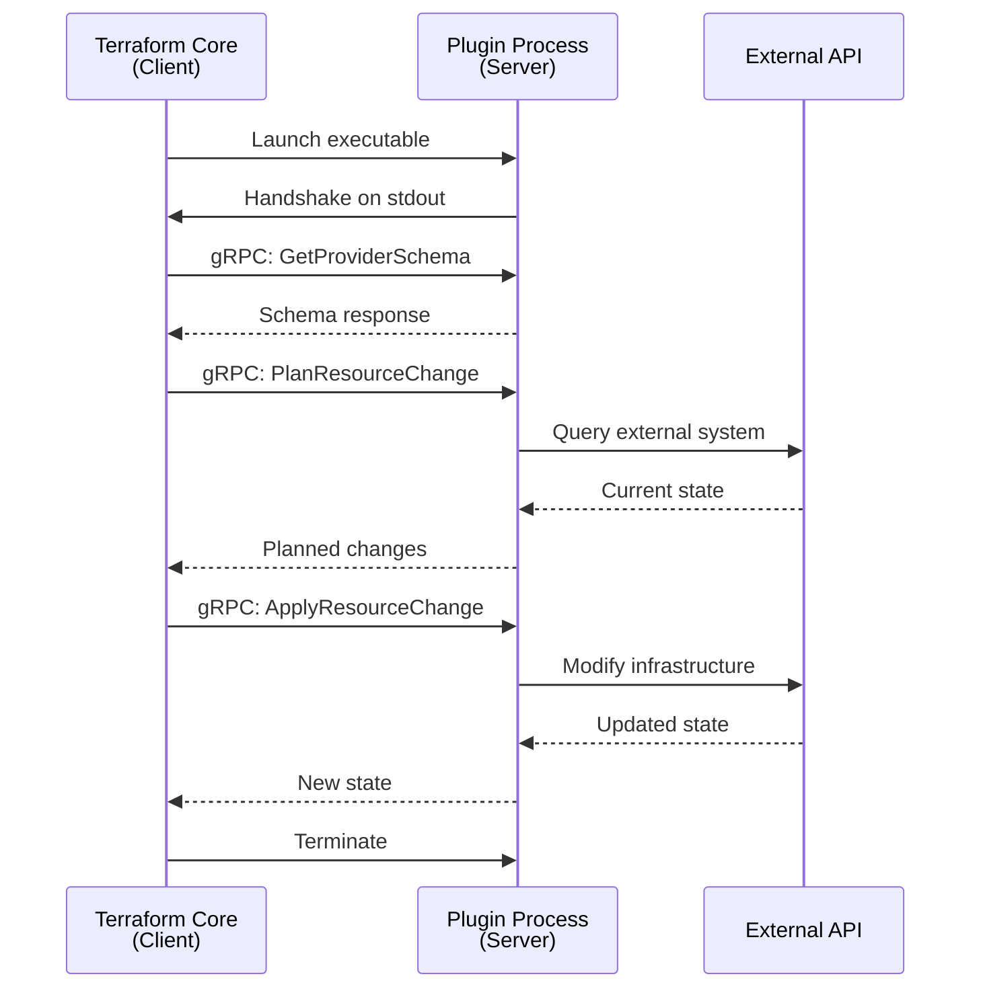
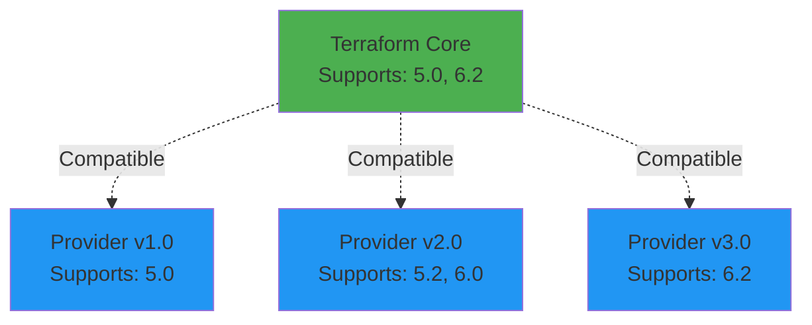

Terraform communicates with provider plugins using a gRPC-based protocol. This allows providers to be developed in any language and distributed separately from Terraform Core.

## Protocol Overview

Terraform plugins follow a **local RPC model**:



### Process Model

**Terraform Core (client):**
- Discovers plugin executables
- Launches plugins as child processes
- Communicates via loopback interface
- Controls plugin lifecycle

**Provider Plugin (server):**  
- Exposes gRPC services
- Prints handshake to stdout
- Listens on local port
- Terminates when no longer needed

See: `docs/plugin-protocol/README.md`

## Protocol Versioning

The protocol uses major and minor versioning:

### Major Versions

- Breaking changes require new major version
- Version encoded in protobuf package name (`tfplugin5`, `tfplugin6`)
- Both sides negotiate mutually-supported version
- Multiple versions can coexist

### Minor Versions

- Backward-compatible enhancements
- Optional features that can be ignored
- No protocol package name change
- Feature detection at runtime

<Note>
Current versions:
- **Protocol 5.x**: Introduced with Terraform 0.12
- **Protocol 6.x**: Latest version with tidier naming

Protocol definitions are immutable after release.
</Note>

### Version Compatibility



If no mutual version exists, Terraform returns an error during `terraform init`.

See: `docs/plugin-protocol/README.md:104`

## Protocol Buffers Definition

The protocol is defined using Protocol Buffers:

```protobuf
// tfplugin6.proto (simplified)
syntax = "proto3";
package tfplugin6;

service Provider {
    rpc GetProviderSchema(GetProviderSchema.Request) 
        returns (GetProviderSchema.Response);
    rpc ValidateProviderConfig(ValidateProviderConfig.Request)
        returns (ValidateProviderConfig.Response);
    rpc ValidateResourceConfig(ValidateResourceConfig.Request)
        returns (ValidateResourceConfig.Response);
    rpc PlanResourceChange(PlanResourceChange.Request)
        returns (PlanResourceChange.Response);
    rpc ApplyResourceChange(ApplyResourceChange.Request)
        returns (ApplyResourceChange.Response);
    rpc UpgradeResourceState(UpgradeResourceState.Request)
        returns (UpgradeResourceState.Response);
    rpc ReadResource(ReadResource.Request)
        returns (ReadResource.Response);  
    rpc ImportResourceState(ImportResourceState.Request)
        returns (ImportResourceState.Response);
    rpc Stop(Stop.Request)
        returns (Stop.Response);
}
```

Full definitions: `docs/plugin-protocol/tfplugin5.proto`, `docs/plugin-protocol/tfplugin6.proto`

## Wire Format for Values

Terraform values are serialized using `DynamicValue`:

```protobuf
message DynamicValue {
    bytes msgpack = 1;  // Preferred
    bytes json = 2;     // Fallback
}
```

### MessagePack Encoding

**Preferred format** - compact binary representation.

<Tabs>
<Tab title="Primitive Types">
```
Terraform Type → MessagePack Type
───────────────────────────────
string          → MessagePack string (UTF-8)
number          → MessagePack int/float/string*
bool            → MessagePack boolean
null            → MessagePack nil

* Large numbers use string to preserve precision
```
</Tab>

<Tab title="Collection Types">  
```
Terraform Type → MessagePack Type
───────────────────────────────
list(T)         → MessagePack array
set(T)          → MessagePack array (unordered)
map(T)          → MessagePack map
object({...})   → MessagePack map
tuple([...])    → MessagePack array
```
</Tab>

<Tab title="Special Types">
```
Terraform Type → MessagePack Type
───────────────────────────────
unknown         → Extension type 0 or 12
dynamic         → Array [type_json, value]
```
</Tab>
</Tabs>

See: `docs/plugin-protocol/object-wire-format.md:36`

### Unknown Values

Unknown values use MessagePack extensions:

<CodeGroup>
```
Extension Code 0 (Legacy)
─────────────────────────
Wholly unknown value
Payload ignored
```

```
Extension Code 12 (Refined)
───────────────────────────
Unknown with constraints
Payload: MessagePack map

Refinement Keys:
  1: nullness (bool)
  2: string prefix
  3: lower bound (number)
  4: upper bound (number)  
  5: min collection length
  6: max collection length
```
</CodeGroup>

**Example:** Unknown string starting with "https://":

```
Extension {
  code: 12,
  payload: map {
    2: "https://"
  }
}
```

See: `docs/plugin-protocol/object-wire-format.md:94`

### Block Encoding

Resource blocks become MessagePack maps:

```hcl
resource "aws_instance" "example" {
  ami           = "ami-123456"  # Attribute
  instance_type = "t2.micro"    # Attribute
  
  ebs_block_device {            # Nested block
    device_name = "/dev/sda1"
  }
}
```

↓ Encoded as:

```javascript
{
  "ami": "ami-123456",           // Attribute
  "instance_type": "t2.micro",   // Attribute
  "ebs_block_device": [          // Nested block (list nesting)
    {
      "device_name": "/dev/sda1"
    }
  ]
}
```

**Nested block nesting modes:**

- `SINGLE`: Single value or nil
- `LIST`: Array preserving order
- `SET`: Array in undefined order  
- `MAP`: Map with block labels as keys
- `GROUP`: Like `SINGLE` but synthesizes empty block if absent

See: `docs/plugin-protocol/object-wire-format.md:50`

### JSON Encoding

**Secondary format** for compatibility:

- Used when MessagePack not available
- Simpler but less efficient
- Cannot represent unknown values (limitation)
- Servers should always send MessagePack

See: `docs/plugin-protocol/object-wire-format.md:187`

## Provider Methods

Key RPC methods in the provider protocol:

### GetProviderSchema

Returns schema for provider, resources, and data sources:

```protobuf
message GetProviderSchema {
    message Request {}
    
    message Response {
        Schema provider = 1;
        map<string, Schema> resource_schemas = 2;
        map<string, Schema> data_source_schemas = 3;
        repeated Diagnostic diagnostics = 4;
        ServerCapabilities server_capabilities = 5;
    }
}

message Schema {
    message Block {
        repeated Attribute attributes = 1;
        repeated NestedBlock block_types = 2;
    }
    
    message Attribute {
        string name = 1;
        bytes type = 2;        // JSON-encoded type constraint
        string description = 3;
        bool required = 4;
        bool optional = 5;
        bool computed = 6;
        bool sensitive = 7;
    }
}
```

Called once during initialization. Cached for the provider's lifetime.

### ValidateResourceConfig

Validates resource configuration before planning:

```protobuf
message ValidateResourceConfig {
    message Request {
        string type_name = 1;
        DynamicValue config = 2;
    }
    
    message Response {
        repeated Diagnostic diagnostics = 1;
    }
}
```

May be called multiple times as configuration becomes more complete.

### PlanResourceChange

**Most important method** - creates execution plan:

```protobuf
message PlanResourceChange {
    message Request {
        string type_name = 1;
        DynamicValue prior_state = 2;
        DynamicValue proposed_new_state = 3;
        DynamicValue config = 4;
        bytes prior_private = 5;
        DynamicValue provider_meta = 6;
    }
    
    message Response {
        DynamicValue planned_state = 1;
        repeated AttributePath requires_replace = 2;
        bytes planned_private = 3;
        repeated Diagnostic diagnostics = 4;
        bool legacy_type_system = 5;
        Deferred deferred = 6;
    }
}
```

**Called twice per resource:**

1. **During planning** - Configuration may contain unknown values
2. **During apply** - All configuration values are known

**Provider must:**
- Return planned state matching type schema
- Preserve known config values in planned state  
- Mark unpredictable values as unknown
- Indicate which changes require replacement

See: `docs/resource-instance-change-lifecycle.md:134`

### ApplyResourceChange

Executes the planned change:

```protobuf
message ApplyResourceChange {
    message Request {
        string type_name = 1;
        DynamicValue prior_state = 2;
        DynamicValue planned_state = 3;
        DynamicValue config = 4;
        bytes planned_private = 5;  
        DynamicValue provider_meta = 6;
    }
    
    message Response {
        DynamicValue new_state = 1;
        bytes private = 2;
        repeated Diagnostic diagnostics = 3;
        bool legacy_type_system = 4;
        Deferred deferred = 5;
    }
}
```

**Provider must:**
- Make actual infrastructure changes
- Return new state matching planned state for known values
- Replace unknown values with actual results
- Not modify known values from planned state

See: `docs/resource-instance-change-lifecycle.md:188`

### ReadResource

Refreshes resource state from infrastructure:

```protobuf
message ReadResource {
    message Request {
        string type_name = 1;
        DynamicValue current_state = 2;
        bytes private = 3;
        DynamicValue provider_meta = 4;
    }
    
    message Response {
        DynamicValue new_state = 1;
        repeated Diagnostic diagnostics = 2;
        bytes private = 3;
        Deferred deferred = 4;
    }
}
```

**Provider should:**
- Query current infrastructure state
- Distinguish **normalization** vs. **drift**
- Preserve user-written values when semantically unchanged
- Report actual drift when infrastructure changed

See: `docs/resource-instance-change-lifecycle.md:252`

### UpgradeResourceState  

Migrates state from older provider versions:

```protobuf
message UpgradeResourceState {
    message Request {
        string type_name = 1;
        int64 version = 2;
        RawState raw_state = 3;
    }
    
    message Response {
        DynamicValue upgraded_state = 1;
        repeated Diagnostic diagnostics = 2;
    }
}
```

Called when state was written by older schema version.

See: `docs/resource-instance-change-lifecycle.md:224`

### ImportResourceState

Adopts existing infrastructure:

```protobuf  
message ImportResourceState {
    message Request {
        string type_name = 1;
        string id = 2;
    }
    
    message Response {
        repeated ImportedResource imported_resources = 1;
        repeated Diagnostic diagnostics = 2;
        Deferred deferred = 3;
    }
    
    message ImportedResource {
        string type_name = 1;
        DynamicValue state = 2;
        bytes private = 3;
    }
}
```

May return partial state that `ReadResource` will complete.

See: `docs/resource-instance-change-lifecycle.md:340`

## Diagnostics

All responses can include diagnostics:

```protobuf
message Diagnostic {
    enum Severity {
        INVALID = 0;
        ERROR = 1;
        WARNING = 2;
    }
    
    Severity severity = 1;
    string summary = 2;
    string detail = 3;
    AttributePath attribute = 4;
}

message AttributePath {
    message Step {
        oneof selector {
            string attribute_name = 1;
            int64 element_key_int = 2;
            string element_key_string = 3;
        }
    }
    repeated Step steps = 1;
}
```

**Severity levels:**
- **ERROR**: Operation failed, cannot continue
- **WARNING**: Potential issue, operation continues

**Attribute paths** highlight specific config locations:

```
aws_instance.example.ebs_block_device[0].device_name
                     └───────────────────────────────
                     AttributePath: [
                       {attribute_name: "ebs_block_device"},
                       {element_key_int: 0},
                       {attribute_name: "device_name"}
                     ]
```

## Provider Capabilities

Providers can advertise optional capabilities:

```protobuf
message ServerCapabilities {
    bool plan_destroy = 1;
    GetProviderSchemaOptional get_provider_schema_optional = 2;
    MoveResourceState move_resource_state = 3;
}
```

## Deferred Changes

Providers can defer changes (protocol 6.x):

```protobuf  
message Deferred {
    enum Reason {
        UNKNOWN = 0;
        RESOURCE_CONFIG_UNKNOWN = 1;
        PROVIDER_CONFIG_UNKNOWN = 2;
        ABSENT_PREREQ = 3;
        DEFERRED_PREREQ = 4;
    }
    Reason reason = 1;
}
```

Allows multi-round planning when dependencies are unknown.

## SDK Implementation

Most providers use SDKs rather than implementing the protocol directly:

<CardGroup cols={2}>
<Card title="Terraform Plugin Framework" icon="golang" href="https://developer.hashicorp.com/terraform/plugin/framework">
Modern Go SDK with protocol 6 support
</Card>

<Card title="Terraform Plugin SDK" icon="golang" href="https://developer.hashicorp.com/terraform/plugin/sdkv2">  
Legacy Go SDK (protocol 5)
</Card>
</CardGroup>

**SDK responsibilities:**
- Generate protocol buffer stubs
- Handle gRPC communication
- Marshal/unmarshal values
- Provide higher-level abstractions
- Manage plugin lifecycle

## Further Reading

<CardGroup cols={2}>
  <Card title="Resource Lifecycle" icon="arrows-spin" href="/architecture/resource-lifecycle">
    How provider methods fit together
  </Card>
  <Card title="Plugin Protocol Docs" icon="file" href="https://github.com/hashicorp/terraform/tree/main/docs/plugin-protocol">
    Complete protocol specifications
  </Card>
</CardGroup>
