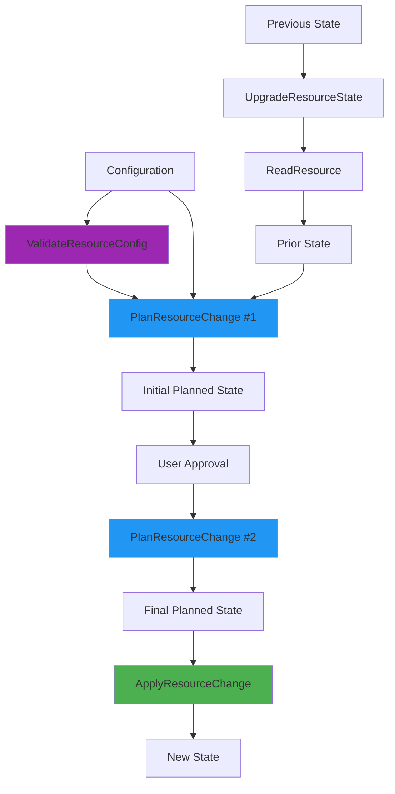
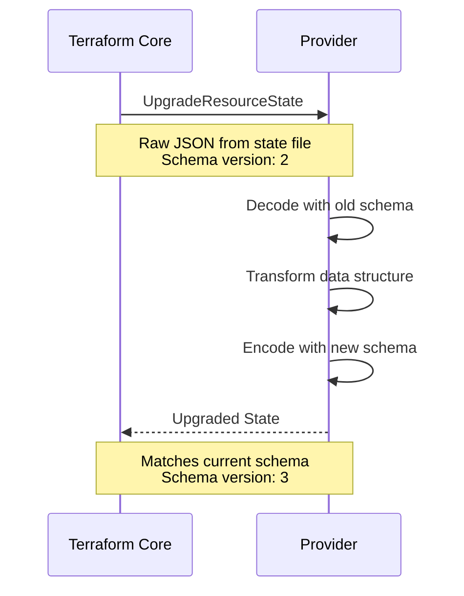
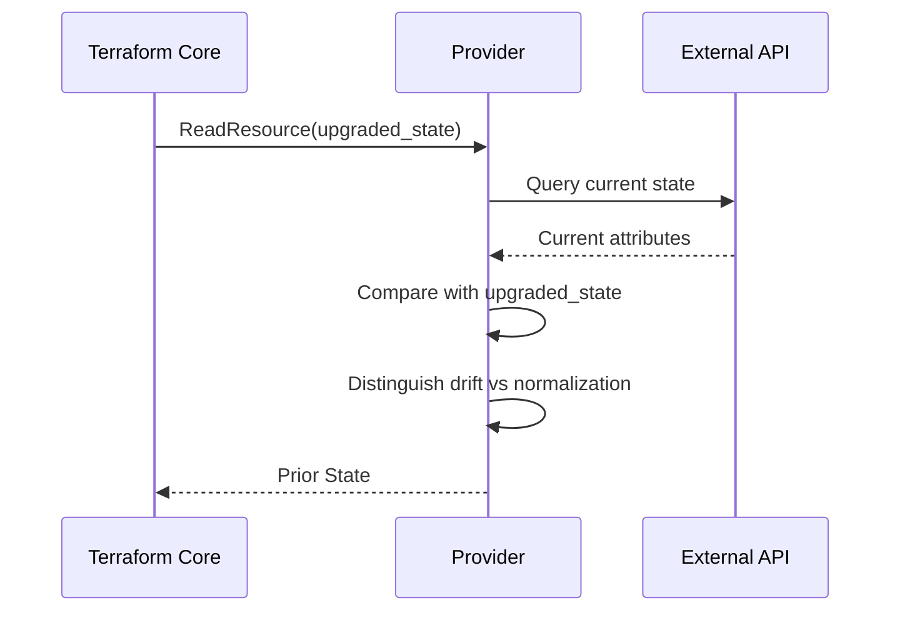
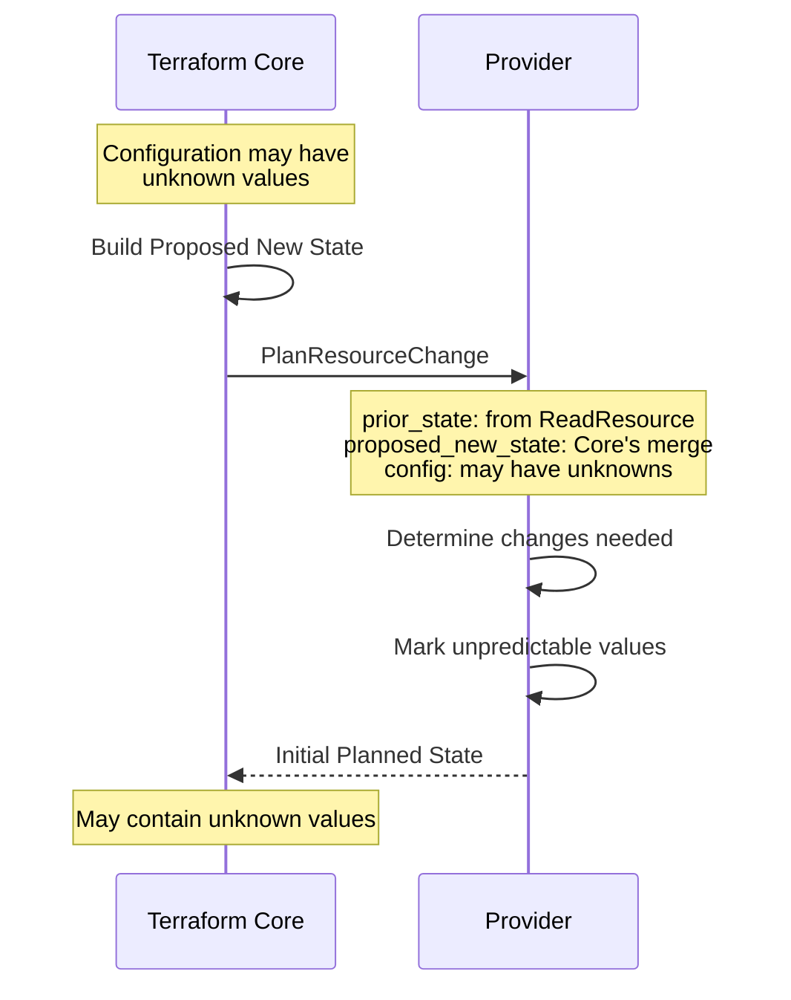
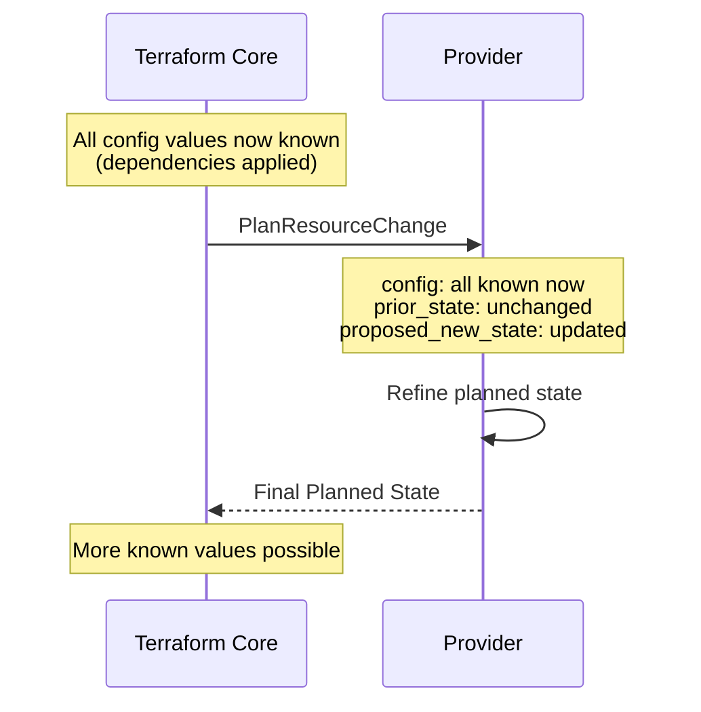
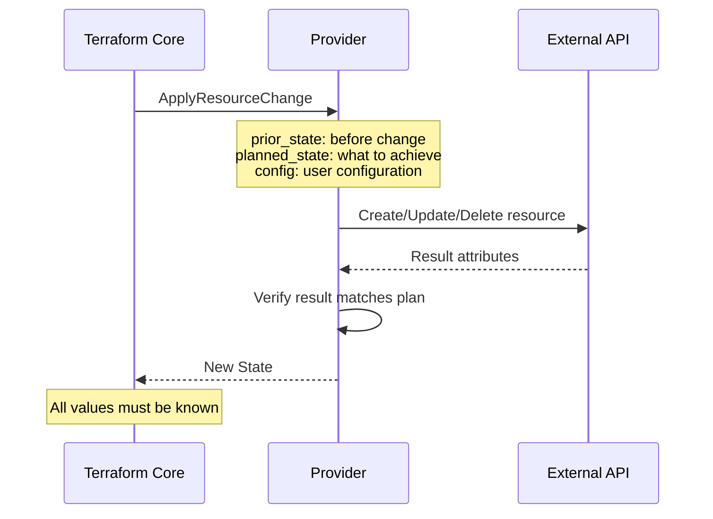
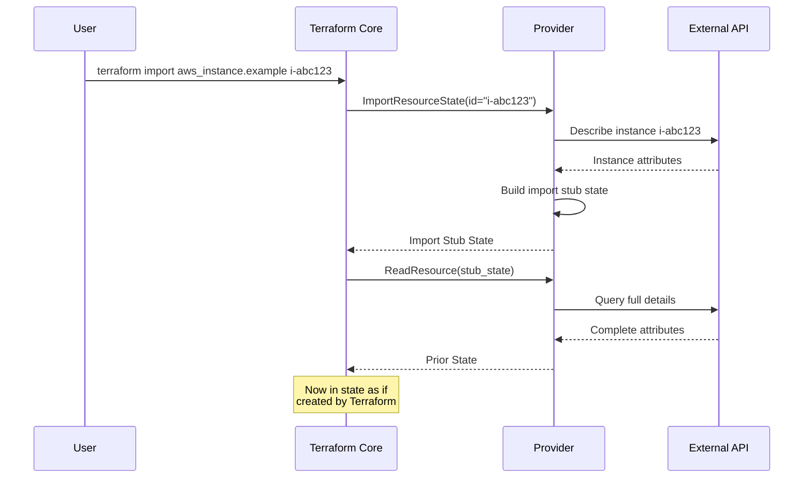

This document describes the complete lifecycle of a Terraform resource instance as it flows through validation, planning, and applying phases.

## Lifecycle Overview

A resource instance moves through several provider method calls:



## State Values Through Lifecycle

Different state representations flow through the lifecycle:

<Tabs>
<Tab title="Configuration">
**User-written values** from `.tf` files.

```hcl
resource "aws_instance" "example" {
  ami           = "ami-123456"
  instance_type = "t2.micro"
  tags = {
    Name = "example-instance"
  }
}
```

- Null for unspecified optional attributes
- May contain unknown values (from other resources)
- Type-converted to match schema
</Tab>

<Tab title="Prior State">  
**Provider's representation** of current infrastructure.

```json
{
  "ami": "ami-123456",
  "instance_type": "t2.micro",
  "id": "i-1234567890abcdef0",
  "tags": {"Name": "example-instance"},
  "public_ip": "52.1.2.3"
}
```

- Result of last `ApplyResourceChange` or `ReadResource`
- Fully known values only
- May be stale (drift)
</Tab>

<Tab title="Proposed New State">
**Terraform Core's initial merge** of config and prior state.

```json
{
  "ami": "ami-123456",         // From config
  "instance_type": "t2.micro",  // From config  
  "id": "i-1234567890abcdef0",  // From prior state (computed)
  "tags": {"Name": "example-instance"},
  "public_ip": "52.1.2.3"      // From prior state (computed)
}
```

- Config values override prior state
- Computed values preserved from prior state
- Provided to help provider planning
</Tab>

<Tab title="Planned State">
**Provider's prediction** of final state.

```json
{
  "ami": "ami-123456",
  "instance_type": "t2.micro",
  "id": "<unknown>",           // Will be assigned
  "tags": {"Name": "example-instance"},
  "public_ip": "<unknown>"     // Will be assigned
}
```

- Known config values preserved exactly
- Unknown values for unpredictable attributes  
- Refinements constrain unknown values
</Tab>

<Tab title="New State">
**Actual result** after applying changes.

```json
{
  "ami": "ami-123456",
  "instance_type": "t2.micro",
  "id": "i-abcdef1234567890",
  "tags": {"Name": "example-instance"},
  "public_ip": "52.5.6.7"
}
```

- All values must be known
- Known planned values unchanged
- Unknown planned values resolved
</Tab>
</Tabs>

See: `docs/resource-instance-change-lifecycle.md`

## Phase 1: Previous Run State

When Terraform starts, it has the **Previous Run State** from the last operation.

### UpgradeResourceState

Handles provider version upgrades:



**Provider responsibilities:**

- Accept raw state data (any format)
- Identify schema version
- Transform to current schema
- **Do not** detect external changes
- **Do not** call external APIs

<CodeGroup>
```go Provider Implementation
func (p *Provider) UpgradeResourceState(
    req UpgradeResourceStateRequest,
) UpgradeResourceStateResponse {
    // Decode old state
    var oldState OldResourceStateV2
    json.Unmarshal(req.RawState.JSON, &oldState)
    
    // Transform to current schema
    newState := ResourceState{
        ID:          oldState.ID,
        Name:        oldState.Name,
        NewField:    "default", // Add new field
        RenamedOld:  oldState.OldFieldName, // Rename
    }
    
    return UpgradeResourceStateResponse{
        UpgradedState: newState,
    }
}
```

```json Example Transformation  
// Schema v2 (old)
{
  "id": "abc123",
  "old_field_name": "value"
}

// Schema v3 (new)
{
  "id": "abc123",
  "renamed_old": "value",
  "new_field": "default"
}
```
</CodeGroup>

See: `docs/resource-instance-change-lifecycle.md:224`

### ReadResource

Detects external changes (drift):



**Provider must distinguish:**

<Tabs>
<Tab title="Normalization">
**Same meaning, different representation**

```json
// In state
{"json_config": "{\"a\": 1}"}

// From API  
{"json_config": "{\"a\":1}"}
```

**Action:** Return state value unchanged (preserve user's format)

**Rationale:** Avoid spurious diffs from whitespace/formatting
</Tab>

<Tab title="Drift">
**Actual external change**

```json
// In state
{"instance_type": "t2.micro"}

// From API
{"instance_type": "t2.small"}
```

**Action:** Return API value (report drift)

**Rationale:** User needs to know infrastructure changed
</Tab>
</Tabs>

**Special cases:**

- **Write-only attributes**: Cannot detect drift (e.g., passwords)
- **Resource deleted**: Return null state
- **Partial read failure**: Return best-effort state + diagnostics

See: `docs/resource-instance-change-lifecycle.md:252`

## Phase 2: Planning

Planning happens in **two calls** to `PlanResourceChange`.

### First PlanResourceChange (Planning Phase)

Called during `terraform plan`:



**Inputs:**

- `prior_state`: Current infrastructure state
- `proposed_new_state`: Terraform Core's merge suggestion
- `config`: User configuration (may have unknown values)

**Provider must:**

1. Preserve non-null config values **exactly**
2. Use proposed_new_state as starting point
3. Mark unpredictable attributes as unknown
4. Return known values where possible
5. Indicate required replacements via `requires_replace`

<CodeGroup>
```go Planning Logic
func (p *Provider) PlanResourceChange(
    req PlanResourceChangeRequest,
) PlanResourceChangeResponse {
    planned := req.ProposedNewState.Copy()
    
    // Preserve config values
    for attr, val := range req.Config.Attributes {
        if !val.IsNull() {
            planned.Attributes[attr] = val
        }
    }
    
    // Mark computed values as unknown if dependencies changed
    if req.Config.AMI != req.PriorState.AMI {
        planned.PublicIP = cty.UnknownVal(cty.String)
        planned.ID = cty.UnknownVal(cty.String)
    }
    
    // Indicate if replacement needed
    var requiresReplace []cty.Path
    if req.Config.AMI != req.PriorState.AMI {
        requiresReplace = append(requiresReplace,
            cty.GetAttrPath("ami"))
    }
    
    return PlanResourceChangeResponse{
        PlannedState:     planned,
        RequiresReplace:  requiresReplace,
    }
}
```

```json Example Plan Output
// Config has unknown value
{
  "ami": "<unknown>",
  "instance_type": "t2.micro"
}

// Initial planned state
{
  "ami": "<unknown>",         // Still unknown
  "instance_type": "t2.micro", // Known from config
  "id": "<unknown>",           // Computed, unknown
  "public_ip": "<unknown>"     // Computed, unknown
}
```
</CodeGroup>

**Constraints enforced by Terraform:**

- Non-null config values must appear unchanged in plan
- Null optional+computed attributes may be set to any value  
- Planned known values cannot change in `ApplyResourceChange`

See: `docs/resource-instance-change-lifecycle.md:134`

### Second PlanResourceChange (Apply Phase)

Called during `terraform apply` **before** applying:



**Differences from first call:**

- All config values are **known** (dependencies applied)
- Can refine previous unknowns to known values
- Can replace unknowns with better unknowns (refinements)
- **Cannot change** previously known values

**Terraform enforces:**

- Known values from initial plan must be identical
- Unknown values can become known or stay unknown
- Unknown values can gain refinements

**Example refinement:**

```json
// Initial Planned State
{
  "url": "<unknown string>"
}

// Final Planned State (after config becomes known)
{
  "url": "<unknown string with prefix 'https://'>"
}
```

See: `docs/resource-instance-change-lifecycle.md:160`

## Phase 3: Applying

### ApplyResourceChange

Executes the planned change:



**Provider must:**

1. Make actual infrastructure changes
2. Preserve all known values from `planned_state`
3. Replace unknown values with actual results
4. Return all-known state (no unknowns allowed)
5. Return error if actual result doesn't match plan

<CodeGroup>
```go Apply Implementation
func (p *Provider) ApplyResourceChange(
    req ApplyResourceChangeRequest,
) ApplyResourceChangeResponse {
    var newState ResourceState
    
    switch req.PlannedState.ID.IsNull() {
    case true:
        // Create new resource
        resp := api.CreateInstance(
            AMI:          req.PlannedState.AMI,
            InstanceType: req.PlannedState.InstanceType,
        )
        newState = ResourceState{
            ID:           resp.ID,          // Was unknown
            AMI:          req.PlannedState.AMI, // Known in plan
            InstanceType: req.PlannedState.InstanceType,
            PublicIP:     resp.PublicIP,    // Was unknown
        }
        
    case false:
        // Update existing resource
        api.UpdateInstance(
            ID:  req.PriorState.ID,
            AMI: req.PlannedState.AMI,
        )
        newState = req.PlannedState // Already fully known
    }
    
    return ApplyResourceChangeResponse{
        NewState: newState,
    }
}
```

```json State Evolution
// Planned State
{
  "ami": "ami-123456",
  "instance_type": "t2.micro",
  "id": "<unknown>",
  "public_ip": "<unknown>"
}

// New State (after apply)  
{
  "ami": "ami-123456",        // Preserved
  "instance_type": "t2.micro", // Preserved
  "id": "i-abc123",            // Resolved
  "public_ip": "52.1.2.3"      // Resolved
}
```
</CodeGroup>

**Error handling:**

If apply fails partway:
- Return partial new state showing what was created
- Include diagnostics explaining failure  
- Terraform saves partial state for recovery

See: `docs/resource-instance-change-lifecycle.md:188`

## Special Cases

### Import Workflow

Adopting existing infrastructure:



**ImportResourceState responsibilities:**

- Accept provider-defined ID string
- Query external system
- Return **minimal** state for `ReadResource` to complete
- May return **partial** state for write-only attributes

**Partial import handling:**

```json
// Import stub (partial)
{
  "id": "i-abc123",
  "password": null  // Write-only, cannot retrieve
}

// After ReadResource  
{
  "id": "i-abc123",
  "ami": "ami-123456",
  "instance_type": "t2.micro",
  "password": null  // User must provide in config
}
```

User must add `password` to configuration to match imported resource.

See: `docs/resource-instance-change-lifecycle.md:318`

### Replace Triggered By

Forced replacement due to triggers:

```hcl
resource "aws_instance" "example" {
  ami = aws_ami.latest.id
  
  lifecycle {
    replace_triggered_by = [aws_ami.latest]
  }
}
```

When `aws_ami.latest` changes:
1. Terraform marks `aws_instance.example` for replacement
2. `PlanResourceChange` receives indication of forced replacement
3. Provider plans destroy + create even if config unchanged

### Create Before Destroy

Minimize downtime during replacement:

```hcl
resource "aws_instance" "example" {
  lifecycle {
    create_before_destroy = true
  }
}
```

**Execution order:**

1. Create new instance
2. Update dependencies to point to new instance
3. Destroy old instance

Requires careful handling of unique constraints (names, IPs, etc.).

## Validation Rules

Terraform enforces contracts at each phase:

### ValidateResourceConfig

```go
// Called multiple times with increasing config completeness
validate(config_with_unknowns)     // OK
validate(config_mostly_known)      // OK
validate(config_fully_known)       // Must pass
```

- Should tolerate unknown values
- Report errors for definitely-invalid configs
- May return warnings for potentially-invalid configs

### PlanResourceChange

<Tabs>
<Tab title="Config Values">
```
Rule: Non-null config values must be preserved

config.ami = "ami-123456"

planned_state.ami = "ami-123456"  ✓ Correct
planned_state.ami = "ami-789012"  ✗ Invalid
planned_state.ami = unknown       ✗ Invalid
```
</Tab>

<Tab title="Computed Values">
```  
Rule: Optional+computed null in config → provider decides

config.public_ip = null
prior_state.public_ip = "52.1.2.3"

planned_state.public_ip = "52.1.2.3"  ✓ Preserve
planned_state.public_ip = unknown      ✓ Will change
planned_state.public_ip = "52.5.6.7"   ✓ Provider knows
```
</Tab>

<Tab title="Plan Consistency">  
```
Rule: Second plan must not change known values

initial_plan.ami = "ami-123456"

final_plan.ami = "ami-123456"  ✓ Identical
final_plan.ami = "ami-789012"  ✗ Changed known value

initial_plan.public_ip = unknown
final_plan.public_ip = "52.1.2.3"     ✓ Refined unknown
final_plan.public_ip = unknown         ✓ Still unknown  
```
</Tab>
</Tabs>

See: `docs/resource-instance-change-lifecycle.md:143`

### ApplyResourceChange

```
Rule: New state must match planned state for known values

planned_state.ami = "ami-123456"
new_state.ami = "ami-123456"  ✓ Matches
new_state.ami = "ami-789012"  ✗ Provider changed value!

planned_state.public_ip = unknown
new_state.public_ip = "52.1.2.3"  ✓ Resolved unknown
new_state.public_ip = unknown      ✗ Must be known now!
```

See: `docs/resource-instance-change-lifecycle.md:202`

## Nested Blocks

Blocks have special rules:

```hcl
resource "aws_instance" "example" {
  ebs_block_device {  # Block (not attribute)
    device_name = "/dev/sda1"
  }
}
```

**Block constraints:**

- Number of blocks fixed during planning
- Cannot add/remove blocks during apply
- Each block must have corresponding planned block

**Reporting extra blocks:**

Use separate computed attribute:

```hcl
resource "compute_instance" "example" {
  network_interface {  # User-specified
    name = "eth0"
  }
  
  # Separate attribute for provider-created interfaces
  all_network_interfaces = [  # Computed attribute
    {name = "eth0"},           # From block
    {name = "eth1"}            # Auto-created by provider
  ]
}
```

See: `docs/resource-instance-change-lifecycle.md:296`

## Further Reading

<CardGroup cols={2}>
  <Card title="Plugin Protocol" icon="plug" href="/architecture/plugin-protocol">
    RPC method specifications
  </Card>
  <Card title="Graph Evaluation" icon="diagram-project" href="/architecture/graph-evaluation">
    How resources are scheduled
  </Card>
</CardGroup>
