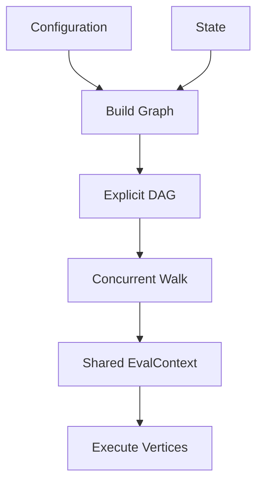
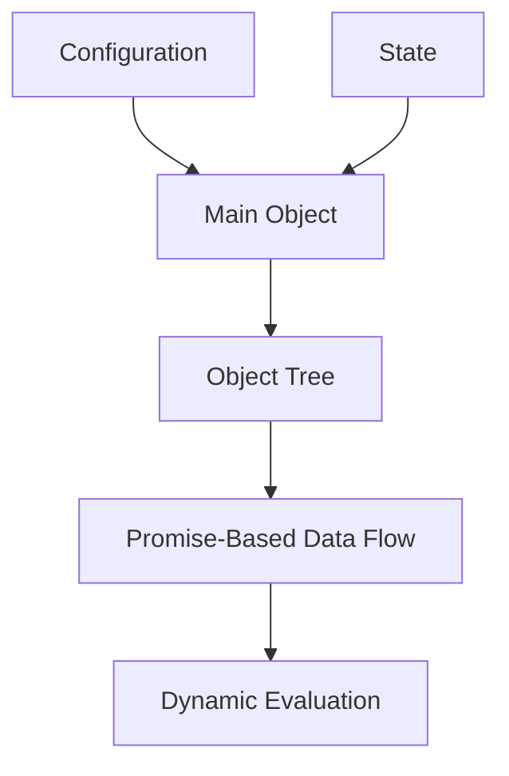
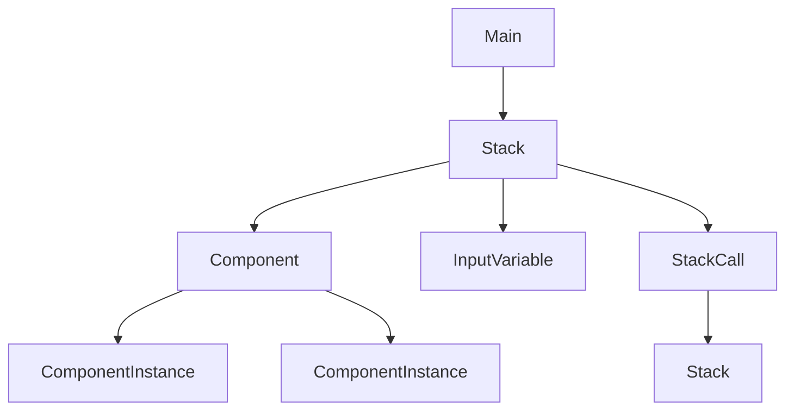
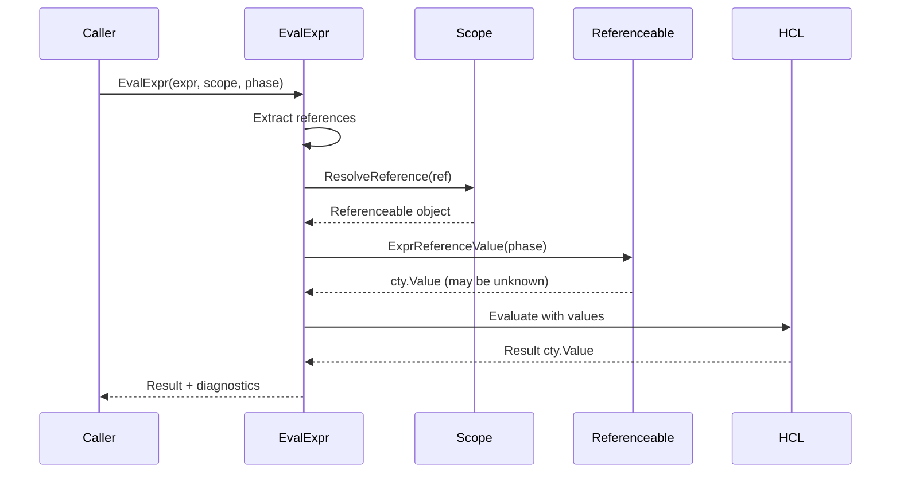

Terraform Stacks provides an orchestration layer on top of zero or more trees of Terraform modules. The stacks runtime (`internal/stacks/stackruntime`) uses a fundamentally different execution model than the traditional modules runtime.

## Architecture Philosophy

While the modules runtime builds explicit dependency graphs and walks them, the stacks runtime constructs an **implicit data flow graph** dynamically during evaluation.

### Modules Runtime vs. Stacks Runtime

<Tabs>
<Tab title="Modules Runtime">


**Characteristics:**
- Explicit graph construction
- Walker-controlled concurrency
- Shared mutable `EvalContext`
- Static dependency analysis
</Tab>

<Tab title="Stacks Runtime">


**Characteristics:**
- Implicit data flow graph
- Promise-based concurrency  
- Immutable method calls
- Dynamic dependency discovery
</Tab>
</Tabs>

## Core Components

The stacks runtime is organized around several key packages under `internal/stacks/`:

### Package Structure

```
internal/stacks/
├── stackaddrs/       # Address types for stacks language
├── stackconfig/      # Configuration loading and parsing
├── stackplan/        # Plan data structures
├── stackstate/       # State data structures  
├── stackruntime/     # Runtime execution
│   └── internal/
│       └── stackeval/  # Core evaluation logic
└── tfstackdata1/     # Protocol buffers for plan/state
```

### stackaddrs - Address Types

Analogous to top-level `addrs` package but for stacks:

```go
// Example stack-specific addresses
type Stack string
type Component string  
type StackCall string

// Incorporates module addresses from addrs package
type AbsComponent struct {
    Stack addrs.StackInstance
    Item  Component
}
```

Builds on `addrs` package since stacks wrap modules.

### stackconfig - Configuration

Loads and parses `.tfstack.hcl` files:

```go
type Config struct {
    Stack      *Stack
    Components map[string]*Component
    Variables  map[string]*Variable
    // ...
}
```

Provides static validation before dynamic evaluation.

### stackruntime - Execution

The public API for executing stacks operations:

```go
// Factory functions for different phases
func NewForValidating(...) *Main
func NewForPlanning(...) *Main  
func NewForApplying(...) *Main
func NewForInspecting(...) *Main
```

See: `internal/stacks/README.md`

## Object Model

The runtime uses a tree of objects rather than a flat graph:



### Config vs. Dynamic Objects

Each concept has two object types:

<CardGroup cols={2}>
<Card title="Config Objects" icon="file-code">
**Static configuration**

Example: `InputVariableConfig`

- Represents blocks in `.tfstack.hcl`
- Static validation only
- No dynamic evaluation
- Singleton per `Main`
</Card>

<Card title="Dynamic Objects" icon="bolt">
**Runtime instances**  

Example: `InputVariable`

- Evaluates expressions
- Interacts with providers
- Creates plans/applies changes
- Singleton per evaluation phase
</Card>
</CardGroup>

**Responsibility split:**

- **Config objects**: Validate that references to non-existent objects don't exist
- **Dynamic objects**: Perform all dynamic expression evaluation and external interaction

This allows early error detection during validation.

### Calls vs. Instances  

Some objects have an additional layer:

```go
// Stack call configuration
type StackCallConfig struct {
    ForEach hcl.Expression
    // ...
}

// Dynamic stack call (evaluates for_each)
type StackCall struct {
    config *StackCallConfig
    instances map[addrs.InstanceKey]*StackCallInstance
}

// Individual instance
type StackCallInstance struct {
    call *StackCall
    key  addrs.InstanceKey
}
```

**Three-tier hierarchy** for `component`, `stack`, and `provider`:

1. **Config** - `component` block declaration
2. **Call** - Handles `for_each` expansion, produces reference value
3. **Instance** - Individual instance, performs actual work

See: `internal/stacks/stackruntime/internal/stackeval/README.md:62`

## Evaluation Phases

Each `Main` object is created for one evaluation phase:

```go
type EvalPhase int

const (
    ValidatePhase EvalPhase = iota
    PlanPhase
    ApplyPhase  
    InspectPhase
)
```

### Phase Characteristics

<Tabs>
<Tab title="ValidatePhase">
**Static validation only**

```go
main := NewForValidating(config)
diags := main.Validate()
```

- No dynamic evaluation
- No provider calls
- Checks configuration validity
- Fast execution
</Tab>

<Tab title="PlanPhase">
**Create execution plan**

```go  
main := NewForPlanning(config, state, opts)
plan, diags := main.Plan()
```

- Evaluates expressions (may have unknowns)
- Calls provider `PlanResourceChange`
- Produces planned changes
- Discovers dependencies
</Tab>

<Tab title="ApplyPhase">  
**Execute planned changes**

```go
main := NewForApplying(plan)
state, diags := main.Apply()
```

- All values must be known
- Calls provider `ApplyResourceChange`  
- Updates real infrastructure
- Produces new state
</Tab>

<Tab title="InspectPhase">
**Query state**

```go
main := NewForInspecting(state)
value, diags := main.EvaluateExpr(expr)
```

- Read-only access to state
- No planning or applying
- Used for console/testing
- Fast queries
</Tab>
</Tabs>

Each phase maintains separate singleton pools to prevent phase contamination.

## Object Singletons

All objects reachable from `Main` must be singletons:

**Why singletons matter:**
- Track asynchronous work in progress
- Cache results of expensive operations  
- Prevent duplicate provider calls
- Ensure consistent results

**Singleton guarantee:**

```go
// BAD: Creates multiple instances
func (s *Stack) GetComponent(name string) *Component {
    return newComponent(s, name) // New every time!
}

// GOOD: Returns cached singleton
func (s *Stack) Component(ctx context.Context, name string) *Component {
    if c, ok := s.components[name]; ok {
        return c // Return cached
    }
    c := newComponent(s, name)
    s.components[name] = c
    return c
}
```

**Enforcement convention:**
- Constructor `newXxx()` is unexported
- Constructor called from exactly one location
- Parent object caches instance in unexported map
- Public method returns cached instance

See: `internal/stacks/stackruntime/internal/stackeval/README.md:106`

## Expression Evaluation

Expression evaluation uses a two-interface pattern:

### EvaluationScope

Resolves references to objects:

```go
type EvaluationScope interface {
    ResolveExpressionReference(
        ctx context.Context,
        ref stackaddrs.Reference,
    ) (Referenceable, tfdiags.Diagnostics)
}
```

**Implementations:**
- `Stack` - Global scope for a stack
- `Component` - Adds `each.key`, `each.value`, `self`
- `StackCall` - Adds call-specific context

### Referenceable  

Provides values for references:

```go
type Referenceable interface {
    ExprReferenceValue(
        ctx context.Context,
        phase EvalPhase,
    ) cty.Value
}
```

**Implementations:**
- `InputVariable` - Returns variable value
- `Component` - Returns outputs (from plan or state)
- `Provider` - Returns provider configuration

### Evaluation Flow



**Steps:**

1. Analyze expressions for `hcl.Traversal` references
2. Parse into `stackaddrs.Reference` addresses
3. Resolve addresses to `Referenceable` objects via `EvaluationScope`  
4. Get `cty.Value` from each via `ExprReferenceValue`
5. Build `hcl.EvalContext` with values
6. Evaluate expression

See: `internal/stacks/stackruntime/internal/stackeval/README.md:194`

## Promise-Based Concurrency

Instead of explicit graph walks, the runtime uses promises:

```go
// Expensive operation returns a promise
func (c *Component) Plan(ctx context.Context) promising.Promise[*ComponentPlan] {
    return promising.Once(func() (*ComponentPlan, error) {
        // This only runs once, even if called multiple times
        provider := c.Provider(ctx) // May block on provider init
        config := c.EvaluatedConfig(ctx) // May block on dependencies
        return provider.PlanComponent(config)
    })
}

// Consumers await the promise  
func (o *Output) Value(ctx context.Context) cty.Value {
    plan := o.component.Plan(ctx).Await() // Blocks until ready
    return plan.Outputs[o.name]
}
```

**Benefits:**

- **Implicit dependencies**: Data flow creates dependency graph automatically
- **Automatic parallelism**: Independent promises run concurrently  
- **No duplicate work**: Promises execute once regardless of consumers
- **Simple reasoning**: No explicit graph construction

See: `internal/promising/README.md` (referenced from stacks runtime)

## Checked vs. Unchecked Results

To avoid duplicate diagnostics, methods come in pairs:

<CodeGroup>
```go Checked Version
// Returns diagnostics - call once per evaluation
func (v *InputVariable) CheckValue(
    ctx context.Context,
    phase EvalPhase,
) (cty.Value, tfdiags.Diagnostics) {
    val, diags := v.evaluate(ctx, phase)
    v.cachedValue = val
    return val, diags
}
```

```go Unchecked Version  
// Returns cached value - call from anywhere
func (v *InputVariable) Value(
    ctx context.Context,
    phase EvalPhase,
) cty.Value {
    if v.cachedValue != cty.NilVal {
        return v.cachedValue
    }
    val, _ := v.CheckValue(ctx, phase) // Discard diagnostics
    return val
}
```
</CodeGroup>

**Invariants:**

1. Every fallible operation can return a placeholder on failure
2. Only one codepath calls the `Check...` variant
3. All other callers use the unprefixed version

**Walk functions** are the single caller of `Check...` variants.

See: `internal/stacks/stackruntime/internal/stackeval/README.md:263`

## Walk Operations

Walks ensure every object gets visited at least once:

### Static Walk

For `ValidatePhase` and `PlanPhase`:

```go
type Validatable interface {
    Validate(ctx context.Context) tfdiags.Diagnostics
}

func walkStatic(ctx context.Context, stack *Stack) tfdiags.Diagnostics {
    var diags tfdiags.Diagnostics
    
    // Visit all config objects
    for _, v := range stack.Variables() {
        diags = diags.Append(v.Validate(ctx))
    }
    for _, c := range stack.Components() {
        diags = diags.Append(c.Validate(ctx))
    }
    // ... more config objects
    
    return diags
}
```

Visits `*Config` objects only.

### Dynamic Walk

For `PlanPhase` and `ApplyPhase`:

```go
type Plannable interface {
    PlanChanges(ctx context.Context) ([]stackplan.PlannedChange, tfdiags.Diagnostics)
}

func walkDynamic(ctx context.Context, stack *Stack) tfdiags.Diagnostics {
    var changes []stackplan.PlannedChange
    var diags tfdiags.Diagnostics
    
    // Visit dynamic objects and instances
    for _, c := range stack.Components() {
        cChanges, cDiags := c.PlanChanges(ctx)
        changes = append(changes, cChanges...)
        diags = diags.Append(cDiags)
    }
    
    return diags  
}
```

Visits both dynamic objects and their instances.

**Walk vs. Data Flow:**

Walks don't control execution order. They ensure every object is visited. The actual order emerges from promise dependencies.

See: `internal/stacks/stackruntime/internal/stackeval/README.md:308`

## Apply-Phase Scheduling

Apply phase needs explicit ordering for component changes:

```go
// Component implements Applyable
type Applyable interface {
    RequiredComponents(ctx context.Context) collections.Set[*Component]
    CheckApply(ctx context.Context) ([]stackstate.AppliedChange, tfdiags.Diagnostics)
}
```

**Dependency discovery:**

1. During plan phase, analyze component references
2. Build component dependency graph
3. Include in plan
4. Use during apply to schedule changes

**Execution scheduling:**

```go
func ChangeExec(ctx context.Context, components []*Component) {
    // Create promise for each component
    promises := make(map[*Component]promising.Promise)
    
    for _, c := range components {
        deps := c.RequiredComponents(ctx)
        
        promises[c] = promising.Task(func() error {
            // Wait for dependencies
            for dep := range deps {
                promises[dep].Await()
            }
            
            // Apply this component
            return c.Apply(ctx)
        })
    }
    
    // All promises execute with correct ordering
    for _, p := range promises {
        p.Await()
    }
}
```

This ensures:
- Components apply in dependency order
- No cycles (detected during planning)
- Maximum parallelism for independent components
- Explicit ordering for side-effects

See: `internal/stacks/stackruntime/internal/stackeval/README.md:364`

## Comparison with Modules Runtime

| Aspect | Modules Runtime | Stacks Runtime |
|--------|----------------|----------------|
| **Dependency Graph** | Explicit, pre-built | Implicit, dynamic |
| **Concurrency** | Walker with semaphore | Promises |
| **Shared State** | Mutable `EvalContext` | Immutable method results |
| **Execution Order** | Static graph edges | Dynamic data flow |
| **Expansion** | Sub-graph creation | Lazy instance creation |
| **Scheduling** | Graph walk algorithm | Promise dependencies |
| **Memory** | O(V+E) graph | O(V) object tree |
| **Complexity** | Graph algorithms | Promise resolution |

## Performance Characteristics

### Memory Usage

- **Object tree**: O(V) where V is configuration objects
- **Promises**: O(P) where P is promise-returning operations
- **No explicit graph**: Saves O(E) for edges

### Concurrency

- **Natural parallelism**: No semaphore limit
- **Data-driven**: Only blocks on actual dependencies  
- **No artificial constraints**: Unlike modules' default parallelism=10

### Lazy Evaluation

- **On-demand**: Only evaluates referenced values
- **Caching**: Promises ensure work happens once
- **Short-circuit**: Errors prevent downstream work

## Further Reading

<CardGroup cols={2}>
  <Card title="Modules Runtime" icon="cube" href="/architecture/modules-runtime">
    Compare with traditional execution model
  </Card>
  <Card title="Resource Lifecycle" icon="arrows-spin" href="/architecture/resource-lifecycle">  
    How components interact with resources
  </Card>
</CardGroup>
