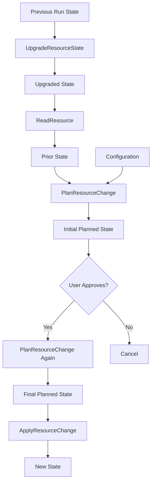

## What is an Execution Plan?

An execution plan is Terraform's proposal for what changes need to be made to bring your infrastructure from its current state to match your configuration. The plan is created during `terraform plan` and executed during `terraform apply`.

<Note>
A key design tenet of Terraform is that **any action with externally-visible side-effects must go through the plan-and-apply workflow**. This ensures predictability and enables review before changes are made.

Source: [`docs/planning-behaviors.md`](https://github.com/hashicorp/terraform/blob/main/docs/planning-behaviors.md:1-9)
</Note>

## The Plan Data Structure

A plan is represented by the [`plans.Plan`](https://github.com/hashicorp/terraform/blob/main/internal/plans/plan.go:23-172) struct, which contains:

```go
type Plan struct {
    // The set of changes to be applied
    Changes *ChangesSrc
    
    // Resources that drifted from expected state
    DriftedResources []*ResourceInstanceChangeSrc
    
    // Previous state before refresh
    PrevRunState *states.State
    
    // Current state after refresh
    PriorState *states.State
    
    // Variable values used during planning
    VariableValues map[string]DynamicValue
    
    // Targeting and filtering
    TargetAddrs []addrs.Targetable
    ForceReplaceAddrs []addrs.AbsResourceInstance
    
    // Plan metadata
    Timestamp time.Time
    Complete bool
    Applyable bool
}
```

<Info>
The plan structure includes both the changes to make (`Changes`) and the context in which those changes were planned (`PriorState`, `VariableValues`, etc.).
</Info>

## Planning Process

The planning process follows these steps, orchestrated by [`context_plan.go`](https://github.com/hashicorp/terraform/blob/main/internal/terraform/context_plan.go):

<Steps>
  <Step title="Load Configuration">
    Parse configuration files and build the configuration tree.
  </Step>
  
  <Step title="Refresh State">
    Read current state of resources from the remote system to detect drift.
    
    This produces `PriorState` by calling [`ReadResource`](https://github.com/hashicorp/terraform/blob/main/docs/resource-instance-change-lifecycle.md:252-294) on providers.
  </Step>
  
  <Step title="Build Plan Graph">
    Construct a dependency graph for the plan operation using [`PlanGraphBuilder`](https://github.com/hashicorp/terraform/blob/main/internal/terraform/graph_builder_plan.go).
  </Step>
  
  <Step title="Walk the Graph">
    Execute each vertex in dependency order, calling provider `PlanResourceChange` for each resource.
  </Step>
  
  <Step title="Collect Changes">
    Aggregate all planned changes into the [`Changes`](https://github.com/hashicorp/terraform/blob/main/internal/plans/changes.go:20-41) structure.
  </Step>
  
  <Step title="Return Plan">
    Package everything into a [`Plan`](https://github.com/hashicorp/terraform/blob/main/internal/plans/plan.go:34) object.
  </Step>
</Steps>

## Action Types

Terraform supports several action types for resource instances:

| Action | Symbol | Description | When It Occurs |
|--------|--------|-------------|----------------|
| **NoOp** | | No changes needed | Resource matches configuration |
| **Create** | `+` | Create new resource | Resource doesn't exist in state |
| **Read** | `↻` | Refresh data source | Data source needs reading |
| **Update** | `~` | Update in-place | Resource exists but attributes differ |
| **Delete** | `-` | Destroy resource | Resource in state but not in config |
| **Replace** | `-/+` or `+/-` | Delete then create, or create then delete | Resource requires replacement |

Implementation: [`plans/action.go`](https://github.com/hashicorp/terraform/blob/main/internal/plans/action.go)

### Replace Actions

Replace is a "meta-action" that decomposes into separate Create and Delete operations:

<Tabs>
  <Tab title="Delete-Before-Create (Default)">
    ```
    1. Delete existing resource
    2. Create new resource at same address
    ```
    
    **Use when:** Resource can tolerate brief downtime
    
    **Risk:** If creation fails, resource is gone
  </Tab>
  
  <Tab title="Create-Before-Delete">
    ```
    1. Mark existing as "deposed"
    2. Create new resource
    3. Delete deposed resource
    ```
    
    **Use when:** Zero-downtime required
    
    **Enabled by:** `lifecycle { create_before_destroy = true }`
  </Tab>
</Tabs>

<Warning>
Create-before-delete requires that two instances of the resource can exist simultaneously. This may not be possible if there are uniqueness constraints (like names or IP addresses).
</Warning>

## Default Planning Behavior

When given no special instructions, Terraform's planning logic (from [`docs/planning-behaviors.md`](https://github.com/hashicorp/terraform/blob/main/docs/planning-behaviors.md:27-66)) automatically proposes:

### Create

When:
- A `resource` block in configuration has no corresponding resource in state
- A `resource` block's `count`/`for_each` includes a new instance key

### Delete

When:
- A resource in state has no corresponding `resource` block in configuration
- A `resource` block's `count`/`for_each` no longer includes an instance key from state

### Update

When:
- Resource exists in both configuration and state
- Provider detects differences that aren't just normalization
- Resource is not marked as "tainted"

### Replace

When:
- Resource exists in both configuration and state
- Resource is marked as "tainted" (previous apply failed)
- Or provider indicates attributes require replacement

## Special Planning Behaviors

Terraform supports three categories of special planning behaviors:

### 1. Configuration-Driven Behaviors

Specified in the Terraform configuration by module authors:

```hcl
resource "aws_instance" "web" {
  # ... configuration ...
  
  lifecycle {
    # Ignore external changes to tags
    ignore_changes = [tags]
    
    # Force replacement when security group changes
    replace_triggered_by = [aws_security_group.web]
    
    # Use create-before-destroy
    create_before_destroy = true
    
    # Prevent accidental deletion
    prevent_destroy = true
  }
}

# Document state refactoring
moved {
  from = aws_instance.old_name
  to   = aws_instance.web
}
```

<Tip>
Configuration-driven behaviors are ideal when the behavior relates to a specific module and should apply for anyone using that module.
</Tip>

### 2. Provider-Driven Behaviors

Activated by providers during `PlanResourceChange`:

- **Forced replacement** - Provider indicates certain attribute changes require replace
- **Normalization** - Provider returns prior state value instead of config value for equivalent serializations
- **Computed values** - Provider sets unknown values that will be determined during apply

```go
// Provider response during planning
PlanResourceChange {
    // Indicate these attributes require replacement
    RequiresReplace: ["availability_zone", "instance_type"]
    
    // Return proposed new state with unknowns
    PlannedState: {
        id: Unknown,  // Will be known after create
        public_ip: Unknown,
        // ...
    }
}
```

Source: [`docs/planning-behaviors.md`](https://github.com/hashicorp/terraform/blob/main/docs/planning-behaviors.md:198-242)

### 3. Single-Run Behaviors

Activated via command-line flags:

```bash
# Force replacement of specific resources
terraform plan -replace=aws_instance.web

# Target specific resources
terraform plan -target=aws_vpc.main

# Refresh-only mode (no changes, just update state)
terraform plan -refresh-only

# Destroy everything
terraform plan -destroy
```

<Warning>
Single-run behaviors require custom support in any wrapper around Terraform Core. Use sparingly and document when you do.
</Warning>

## Resource Instance Change Lifecycle

The full lifecycle of planning and applying a resource change involves multiple provider calls:



<Note>
`PlanResourceChange` is called **twice**: once during planning (with potentially unknown config values) and once during apply (with fully known values).

Source: [`docs/resource-instance-change-lifecycle.md`](https://github.com/hashicorp/terraform/blob/main/docs/resource-instance-change-lifecycle.md:160-186)
</Note>

### Provider Planning Contracts

When providers implement `PlanResourceChange`, they must follow strict contracts:

<AccordionGroup>
  <Accordion title="Configuration Values Must Be Preserved">
    Any attribute that was non-null in configuration must either:
    - Preserve the exact configuration value, OR
    - Return the prior state value (for normalization only)
    
    **Never** change user-provided values to something else.
  </Accordion>
  
  <Accordion title="Computed Attributes Can Be Set">
    Attributes marked as computed in the schema and null in configuration may be set to any appropriate value, or left unknown.
  </Accordion>
  
  <Accordion title="Known Values Are Promises">
    If a planned attribute has a known value, that exact value must appear in the state returned by `ApplyResourceChange`.
    
    Use unknown values when the final value will be determined during apply.
  </Accordion>
  
  <Accordion title="Final Plan Must Match Initial Plan">
    When `PlanResourceChange` is called the second time during apply:
    - Known values from initial plan must remain unchanged
    - Unknown values may become known or stay unknown
  </Accordion>
</AccordionGroup>

Source: [`docs/resource-instance-change-lifecycle.md`](https://github.com/hashicorp/terraform/blob/main/docs/resource-instance-change-lifecycle.md:133-186)

## Plan Files

Plans can be saved to disk for later execution:

```bash
# Create and save plan
terraform plan -out=tfplan

# Apply the saved plan
terraform apply tfplan
```

### Plan File Contents

A plan file (in [`internal/plans/planfile`](https://github.com/hashicorp/terraform/blob/main/internal/plans/planfile/)) contains:

- The complete set of proposed changes
- Prior state snapshots (PrevRunState and PriorState)
- Variable values used during planning
- Provider configurations
- Terraform version information

<Warning>
Plan files may contain sensitive data (passwords, tokens, etc.). Store them securely and never commit to version control.
</Warning>

## Drift Detection

Terraform detects drift during the refresh phase:

```bash
# Show drift without planning changes
terraform plan -refresh-only
```

Drifted resources appear in the plan output:

```
Note: Objects have changed outside of Terraform

Terraform detected the following changes made outside of Terraform
since the last "terraform apply":

  # aws_instance.web has changed
  ~ resource "aws_instance" "web" {
        id            = "i-1234567890abcdef0"
      ~ tags          = {
          ~ "Environment" = "dev" -> "production"
        }
    }
```

Drift is tracked separately in [`Plan.DriftedResources`](https://github.com/hashicorp/terraform/blob/main/internal/plans/plan.go:70).

## Plan Quality

Plans have a quality indicator (from [`plans/quality.go`](https://github.com/hashicorp/terraform/blob/main/internal/plans/quality.go)):

- **Complete** - Plan includes all resources
- **Partial** - Some resources couldn't be planned (but plan is still applyable)
- **Errored** - Planning failed, plan is not applyable

## Plan Metadata

Every plan includes metadata:

```go
type Plan struct {
    // When the plan was created
    Timestamp time.Time
    
    // Is this a complete plan?
    Complete bool
    
    // Can this plan be applied?
    Applyable bool
    
    // Did planning fail?
    Errored bool
    
    // What mode was used? (normal, destroy, refresh-only)
    UIMode Mode
}
```

## Working with Plans in Code

Creating a plan in Terraform Core:

```go
// Create context
ctx, diags := terraform.NewContext(&terraform.ContextOpts{
    Providers: providers,
    // ... other options
})

// Run plan operation
plan, diags := ctx.Plan(config, state, &terraform.PlanOpts{
    Mode: plans.NormalMode,
    SetVariables: variables,
})

// Check if plan is applyable
if plan.Applyable {
    // Save to file
    planfile.Create("tfplan", plan, config, state)
}
```

Source: [`internal/terraform/context_plan.go`](https://github.com/hashicorp/terraform/blob/main/internal/terraform/context_plan.go)

## Why Plans Matter

<CardGroup cols={2}>
  <Card title="Safety" icon="shield-check">
    Review changes before applying prevents accidental destruction or misconfiguration.
  </Card>
  
  <Card title="Predictability" icon="chart-line">
    Know exactly what will change, enabling informed decisions.
  </Card>
  
  <Card title="Audit Trail" icon="list-check">
    Plans can be saved and reviewed later to understand what changed and why.
  </Card>
  
  <Card title="Automation" icon="robot">
    Enable automated approval workflows based on plan analysis.
  </Card>
</CardGroup>

## Best Practices

<AccordionGroup>
  <Accordion title="Always Review Plans">
    Never run `terraform apply` without first reviewing the plan. Use `terraform plan` to preview changes.
  </Accordion>
  
  <Accordion title="Save Plans for Important Changes">
    For production changes, save plans to files and review them before applying:
    ```bash
    terraform plan -out=prod.tfplan
    # Review the plan
    terraform apply prod.tfplan
    ```
  </Accordion>
  
  <Accordion title="Watch for Unexpected Replaces">
    If Terraform plans to replace resources unexpectedly, investigate why before applying. It may indicate:
    - Provider bug
    - Incorrect attribute value
    - Missing `lifecycle` rules
  </Accordion>
  
  <Accordion title="Handle Drift Appropriately">
    When drift is detected, decide whether to:
    - Import the changes into configuration
    - Restore the original state
    - Accept and ignore the drift (`ignore_changes`)
  </Accordion>
</AccordionGroup>

## Next Steps

<CardGroup cols={2}>
  <Card title="Resource Graph" icon="diagram-project" href="/concepts/resource-graph">
    Learn how Terraform determines the order of operations in a plan
  </Card>
  
  <Card title="State Management" icon="database" href="/concepts/state-management">
    Understand how state is used during planning
  </Card>
</CardGroup>

## References

- [Plan Source Code](https://github.com/hashicorp/terraform/blob/main/internal/plans/plan.go)
- [Planning Behaviors Documentation](https://github.com/hashicorp/terraform/blob/main/docs/planning-behaviors.md)
- [Resource Instance Change Lifecycle](https://github.com/hashicorp/terraform/blob/main/docs/resource-instance-change-lifecycle.md)
- [Graph Builder Implementation](https://github.com/hashicorp/terraform/blob/main/internal/terraform/graph_builder_plan.go)