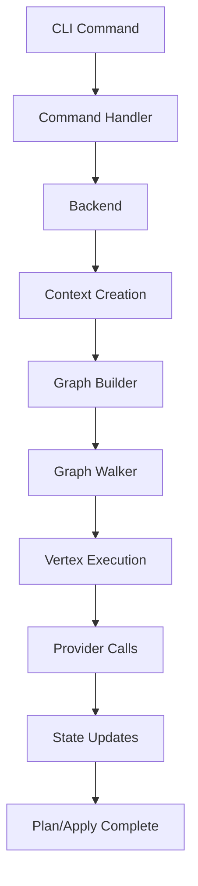

## Introduction

Terraform Core is built on a sophisticated architecture that enables declarative infrastructure management through a well-defined workflow. Understanding these core concepts is essential for working with Terraform effectively, whether you're using it as an operator or contributing to its development.

## The Terraform Workflow

At the highest level, Terraform follows a consistent pattern for managing infrastructure:

<Steps>
  <Step title="Write Configuration">
    Define your infrastructure as code using the Terraform language (HCL)
  </Step>
  
  <Step title="Plan Changes">
    Terraform analyzes your configuration and current state to generate an execution plan
  </Step>
  
  <Step title="Apply Changes">
    Execute the plan to make real infrastructure changes
  </Step>
  
  <Step title="Update State">
    Record the new state of your infrastructure for future operations
  </Step>
</Steps>

## Core Architecture Components

Terraform's architecture consists of several interconnected subsystems that work together to execute infrastructure operations:

### Configuration Layer

The configuration layer handles parsing and validation of Terraform configuration files:

- **Configuration Loader** ([`internal/configs`](https://github.com/hashicorp/terraform/blob/main/internal/configs/)) - Parses `.tf` files and builds a hierarchical configuration model
- **Module System** - Manages composition and reuse of configuration through modules
- **Expression Evaluation** ([`internal/lang`](https://github.com/hashicorp/terraform/blob/main/internal/lang/)) - Interprets HCL expressions and references

<Note>
Configuration files use HCL (HashiCorp Configuration Language), which is parsed into an Abstract Syntax Tree (AST) that Terraform processes during the graph walk.
</Note>

### Execution Engine

The core execution engine orchestrates all Terraform operations:

- **Context** ([`terraform.Context`](https://github.com/hashicorp/terraform/blob/main/internal/terraform/context.go:87)) - The central coordinator for all Terraform operations
- **Graph Builder** - Constructs dependency graphs for different operations (plan, apply, destroy)
- **Graph Walker** - Traverses graphs and executes vertices in dependency order
- **Vertex Execution** - Performs the actual work at each graph node

### State Management

State management tracks the current state of managed infrastructure:

- **State** ([`states.State`](https://github.com/hashicorp/terraform/blob/main/internal/states/state.go:16)) - In-memory representation of infrastructure state
- **State Manager** ([`statemgr`](https://github.com/hashicorp/terraform/blob/main/internal/states/statemgr/)) - Persists state to storage backends
- **Sync State** - Provides thread-safe concurrent access to state during graph walks

### Provider System

Providers are the plugins that interact with external APIs:

- **Provider Plugins** - Implement CRUD operations for specific platforms
- **Provider Protocol** - gRPC-based communication between Core and providers
- **Schema System** - Defines resource types and their attributes

## Key Design Principles

### Infrastructure as Code

Terraform treats infrastructure configuration as source code that can be versioned, reviewed, and tested. The declarative approach focuses on describing the desired end state rather than the steps to achieve it.

<Info>
Learn more about Infrastructure as Code principles in the [Infrastructure as Code](/concepts/infrastructure-as-code) guide.
</Info>

### Immutable Execution Plans

Plans are immutable snapshots of proposed changes that can be reviewed before execution. This separation of planning and execution enables:

- Safe review workflows
- Predictable infrastructure changes
- Audit trails of what changed and why

<Info>
Explore how plans work in the [Execution Plans](/concepts/execution-plans) documentation.
</Info>

### Dependency Graphs

Terraform automatically builds directed acyclic graphs (DAGs) to determine the correct order of operations based on resource dependencies.

<Info>
Understand graph construction in the [Resource Graph](/concepts/resource-graph) guide.
</Info>

### State as Source of Truth

The state file serves as the source of truth for what infrastructure exists, enabling Terraform to calculate the difference between desired and actual state.

<Info>
Dive deeper into state management in the [State Management](/concepts/state-management) documentation.
</Info>

## Request Flow

Here's how a typical Terraform command flows through the system:

<Note>
This diagram shows the simplified flow. The actual implementation in [`internal/terraform/`](https://github.com/hashicorp/terraform/blob/main/internal/terraform/) includes additional steps for validation, optimization, and error handling.
</Note>

## Operation Types

Terraform Core supports several operation types, each with its own graph builder:

| Operation | Purpose | Graph Builder |
|-----------|---------|---------------|
| **Plan** | Calculate proposed changes | [`PlanGraphBuilder`](https://github.com/hashicorp/terraform/blob/main/internal/terraform/graph_builder_plan.go) |
| **Apply** | Execute a plan | [`ApplyGraphBuilder`](https://github.com/hashicorp/terraform/blob/main/internal/terraform/graph_builder_apply.go) |
| **Refresh** | Update state from remote | Specialized refresh graph |
| **Validate** | Check configuration syntax | Validation graph |
| **Destroy** | Remove all resources | Destroy graph variant |

## Concurrency and Parallelism

Terraform executes operations concurrently when possible:

- Default parallelism: **10 concurrent operations**
- Configurable via `-parallelism` flag
- Thread-safe state access via [`SyncState`](https://github.com/hashicorp/terraform/blob/main/internal/states/sync.go)
- Graph walker respects dependencies while maximizing parallelism

<Warning>
Increasing parallelism can improve performance but may trigger rate limits on provider APIs. The default value of 10 balances speed with API constraints.
</Warning>

## Module System

Modules enable composition and reuse:

- **Root Module** - The main configuration directory
- **Child Modules** - Reusable configuration components
- **Module Instances** - Specific instantiations via `count` or `for_each`
- **Module Expansion** - Dynamic graph expansion for module instances

## Next Steps

Now that you understand the high-level architecture, explore each core concept in detail:

<CardGroup cols={2}>
  <Card title="Infrastructure as Code" icon="code" href="/concepts/infrastructure-as-code">
    Learn how Terraform implements declarative infrastructure management
  </Card>
  
  <Card title="Execution Plans" icon="list-check" href="/concepts/execution-plans">
    Understand how Terraform calculates and represents changes
  </Card>
  
  <Card title="Resource Graph" icon="diagram-project" href="/concepts/resource-graph">
    Explore how dependency graphs enable correct operation ordering
  </Card>
  
  <Card title="State Management" icon="database" href="/concepts/state-management">
    Discover how Terraform tracks infrastructure state
  </Card>
</CardGroup>

## References

- [Architecture Documentation](https://github.com/hashicorp/terraform/blob/main/docs/architecture.md)
- [Planning Behaviors](https://github.com/hashicorp/terraform/blob/main/docs/planning-behaviors.md)
- [Resource Instance Change Lifecycle](https://github.com/hashicorp/terraform/blob/main/docs/resource-instance-change-lifecycle.md)