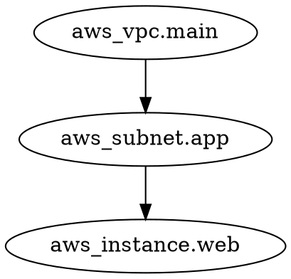

## What is the Resource Graph?

The resource graph is a directed acyclic graph (DAG) that Terraform constructs to represent the relationships between all the objects in your configuration. The graph determines the order in which operations are performed and enables parallel execution when possible.

<Info>
Every Terraform operation (plan, apply, destroy, etc.) builds its own graph tailored to that specific operation. The graph structure varies based on what needs to be accomplished.

Source: [`docs/architecture.md`](https://github.com/hashicorp/terraform/blob/main/docs/architecture.md:162-224)
</Info>

## Graph Components

### Vertices (Nodes)

Vertices represent objects or actions in your infrastructure:

- **Resource Instances** - Individual `resource` blocks or their instances (from `count`/`for_each`)
- **Provider Configurations** - Provider initialization and configuration
- **Module Instances** - Module boundaries and expansion points
- **Output Values** - Output value evaluation
- **Variables** - Input variable evaluation
- **Data Sources** - Data source reads

Implementation: Each vertex type implements different interfaces in [`internal/terraform/`](https://github.com/hashicorp/terraform/blob/main/internal/terraform/)

### Edges

Edges represent "must happen after" relationships:

```
A ──→ B    means    "B must happen after A"
```

Edges ensure:
- Resources are created before their dependents
- Providers are initialized before being used
- Dependencies are destroyed after their dependents

<Note>
Terraform uses **dependency order**, not execution order. The graph walker respects edges but may execute multiple vertices concurrently when they have no dependencies between them.
</Note>

## DAG Implementation

Terraform's DAG is implemented in [`internal/dag`](https://github.com/hashicorp/terraform/blob/main/internal/dag/):

```go
// AcyclicGraph is the core graph type
type AcyclicGraph struct {
    Graph
}

// Graph contains vertices and edges
type Graph struct {
    vertices Set
    edges    Set
}
```

Source: [`dag/dag.go`](https://github.com/hashicorp/terraform/blob/main/internal/dag/dag.go:15-18) and [`dag/graph.go`](https://github.com/hashicorp/terraform/blob/main/internal/dag/graph.go)

### Why Acyclic?

Graphs must be acyclic (no cycles) because cycles would create impossible dependency situations:

```
❌ INVALID (Cycle):
A → B → C → A

Resource A needs B, which needs C, which needs A!
```

Terraform validates graphs and returns an error if cycles are detected.

## Graph Building Process

Graphs are built using the **Transform pattern**, where a series of graph transformers progressively build up the graph.

<Steps>
  <Step title="Start with Empty Graph">
    Begin with an empty graph for the target module path.
  </Step>
  
  <Step title="Apply Transforms">
    Run a sequence of [`GraphTransformer`](https://github.com/hashicorp/terraform/blob/main/internal/terraform/transform.go) implementations that each modify the graph.
  </Step>
  
  <Step title="Validate Graph">
    Ensure the resulting graph is a valid DAG (acyclic, connected properly).
  </Step>
  
  <Step title="Return Graph">
    Return the completed graph ready for walking.
  </Step>
</Steps>

Implementation: [`graph_builder.go`](https://github.com/hashicorp/terraform/blob/main/internal/terraform/graph_builder.go:14-91)

### Key Graph Transforms

Different transforms build different parts of the graph:

| Transform | Purpose | Implementation |
|-----------|---------|----------------|
| [`ConfigTransformer`](https://github.com/hashicorp/terraform/blob/main/internal/terraform/transform_config.go) | Add vertices for `resource` blocks | `transform_config.go` |
| [`StateTransformer`](https://github.com/hashicorp/terraform/blob/main/internal/terraform/transform_state.go) | Add vertices for resources in state | `transform_state.go` |
| [`ReferenceTransformer`](https://github.com/hashicorp/terraform/blob/main/internal/terraform/transform_reference.go) | Create dependency edges from references | `transform_reference.go` |
| [`ProviderTransformer`](https://github.com/hashicorp/terraform/blob/main/internal/terraform/transform_provider.go) | Associate resources with providers | `transform_provider.go` |
| [`ModuleVariableTransformer`](https://github.com/hashicorp/terraform/blob/main/internal/terraform/transform_module_variable.go) | Handle module input variables | `transform_module_variable.go` |
| [`OutputTransformer`](https://github.com/hashicorp/terraform/blob/main/internal/terraform/transform_output.go) | Add output value vertices | `transform_output.go` |
| [`TransitiveReductionTransformer`](https://github.com/hashicorp/terraform/blob/main/internal/terraform/transform_transitive_reduction.go) | Optimize by removing redundant edges | `transform_transitive_reduction.go` |

Source: [`docs/architecture.md`](https://github.com/hashicorp/terraform/blob/main/docs/architecture.md:190-218)

### Example: Plan Graph Building

The plan graph builder applies transforms in this order:

```go
type PlanGraphBuilder struct {
    Steps: []GraphTransformer{
        // Add configuration resources
        &ConfigTransformer{},
        
        // Add state resources
        &StateTransformer{},
        
        // Add providers
        &ProviderTransformer{},
        
        // Create edges from references
        &ReferenceTransformer{},
        
        // Handle module expansion
        &ModuleExpansionTransformer{},
        
        // Optimize edges
        &TransitiveReductionTransformer{},
        
        // ... more transforms
    }
}
```

Source: [`graph_builder_plan.go`](https://github.com/hashicorp/terraform/blob/main/internal/terraform/graph_builder_plan.go)

## Dependency Detection

Terraform automatically detects dependencies through **reference analysis**.

### Implicit Dependencies

Dependencies are inferred from resource references:

```hcl
resource "aws_vpc" "main" {
  cidr_block = "10.0.0.0/16"
}

resource "aws_subnet" "app" {
  vpc_id = aws_vpc.main.id  # ← Creates dependency edge
  cidr_block = "10.0.1.0/24"
}
```

**Resulting Graph:**
```
aws_vpc.main ──→ aws_subnet.app
```

The [`ReferenceTransformer`](https://github.com/hashicorp/terraform/blob/main/internal/terraform/transform_reference.go) analyzes expressions to find references:

<Steps>
  <Step title="Parse Expressions">
    Extract all references from each resource's configuration using [`lang.References`](https://github.com/hashicorp/terraform/blob/main/internal/lang/).
  </Step>
  
  <Step title="Match to Vertices">
    Find which graph vertices correspond to each reference.
  </Step>
  
  <Step title="Create Edges">
    Add "happens after" edges from the vertex to its dependencies.
  </Step>
</Steps>

### Explicit Dependencies

Use `depends_on` for dependencies that can't be inferred:

```hcl
resource "aws_iam_role_policy" "example" {
  name = "example"
  role = aws_iam_role.example.id
  
  # Ensure role is created before policy
  depends_on = [aws_iam_role.example]
}

resource "null_resource" "example" {
  # Wait for EC2 instance even though not referenced
  depends_on = [aws_instance.web]
}
```

<Warning>
Only use `depends_on` when necessary. Terraform automatically handles most dependencies through references. Overuse of `depends_on` reduces parallelism and increases apply time.
</Warning>

## Graph Walking

Once built, the graph is "walked" to execute operations:

```go
// Walker executes vertices in parallel
type Walker struct {
    Callback WalkFunc     // Function to call for each vertex
    Reverse  bool         // Walk direction
}

// Walk the graph
func (g *AcyclicGraph) Walk(walker *Walker) error {
    // Execute vertices in dependency order
    // Multiple vertices can execute concurrently
}
```

Source: [`dag/walk.go`](https://github.com/hashicorp/terraform/blob/main/internal/dag/walk.go:15-68)

### Walk Algorithm

The walk algorithm from [`dag.AcyclicGraph.Walk`](https://github.com/hashicorp/terraform/blob/main/internal/dag/dag.go:232):

<Steps>
  <Step title="Find Ready Vertices">
    Identify vertices with no unmet dependencies (all incoming edges satisfied).
  </Step>
  
  <Step title="Execute Concurrently">
    Execute all ready vertices in parallel (up to parallelism limit).
  </Step>
  
  <Step title="Mark Complete">
    When a vertex completes, mark it done and update dependent vertices.
  </Step>
  
  <Step title="Repeat">
    Find newly ready vertices and repeat until all vertices are complete.
  </Step>
</Steps>

### Concurrency Control

The graph walker manages concurrency:

```go
type ContextGraphWalker struct {
    // Semaphore limits concurrent operations
    parallelSem Semaphore
    
    // Thread-safe state access
    syncState *states.SyncState
}
```

Default parallelism: **10 concurrent operations**

Source: [`graph_walk.go`](https://github.com/hashicorp/terraform/blob/main/internal/terraform/graph_walk.go) and [`context.go`](https://github.com/hashicorp/terraform/blob/main/internal/terraform/context.go:104)

<Tip>
You can adjust parallelism with the `-parallelism` flag:
```bash
terraform apply -parallelism=20
```
Higher values increase speed but may hit provider API rate limits.
</Tip>

## Vertex Execution

Each vertex type has its own execution logic:

```go
// Vertices implement Execute to perform their work
type GraphNodeExecutable interface {
    Execute(ctx EvalContext, op walkOperation) tfdiags.Diagnostics
}
```

Key vertex execution implementations:

- [`NodePlannableResourceInstance.Execute`](https://github.com/hashicorp/terraform/blob/main/internal/terraform/node_resource_plan_instance.go) - Plan a resource
- [`NodeApplyableResourceInstance.Execute`](https://github.com/hashicorp/terraform/blob/main/internal/terraform/node_resource_apply_instance.go) - Apply changes to a resource  
- [`NodeDestroyResourceInstance.Execute`](https://github.com/hashicorp/terraform/blob/main/internal/terraform/node_resource_destroy.go) - Destroy a resource

Source: [`docs/architecture.md`](https://github.com/hashicorp/terraform/blob/main/docs/architecture.md:297-310)

### Execution Steps Example

During plan operation, resource instance execution:

<Steps>
  <Step title="Get Provider">
    Retrieve the provider from EvalContext (already initialized via dependency edge).
  </Step>
  
  <Step title="Get Prior State">
    Retrieve current state for this specific resource instance.
  </Step>
  
  <Step title="Evaluate Configuration">
    Evaluate attribute expressions, fetching values from dependencies via EvalContext.
  </Step>
  
  <Step title="Call Provider">
    Call provider's `PlanResourceChange` to produce the planned changes.
  </Step>
  
  <Step title="Save Diff">
    Store the resulting diff in the plan being constructed.
  </Step>
</Steps>

Source: [`docs/architecture.md`](https://github.com/hashicorp/terraform/blob/main/docs/architecture.md:261-283)

## Dynamic Graph Expansion

Some vertices dynamically expand into subgraphs during execution.

### Count and For-Each

Resources with `count` or `for_each` expand dynamically:

```hcl
resource "aws_instance" "web" {
  count = 3  # Unknown until evaluation
  # ...
}
```

**Graph Evolution:**

```
1. Initial graph:
   aws_instance.web (unexpanded)

2. After expansion:
   aws_instance.web[0]
   aws_instance.web[1]
   aws_instance.web[2]
```

This is necessary because `count` may reference other resources whose values aren't known when the main graph is built:

```hcl
resource "aws_instance" "web" {
  # Count depends on another resource!
  count = length(aws_subnet.app[*].id)
  # ...
}
```

Implementation: Vertices implement [`GraphNodeDynamicExpandable`](https://github.com/hashicorp/terraform/blob/main/internal/terraform/) to create subgraphs.

Source: [`docs/architecture.md`](https://github.com/hashicorp/terraform/blob/main/docs/architecture.md:354-377)

## Graph Types by Operation

Different operations use different graph builders:

<Tabs>
  <Tab title="Plan Graph">
    **Purpose:** Calculate proposed changes
    
    **Key vertices:**
    - Configuration resources (from .tf files)
    - State resources (from state file)
    - Providers
    
    **Builder:** [`PlanGraphBuilder`](https://github.com/hashicorp/terraform/blob/main/internal/terraform/graph_builder_plan.go)
  </Tab>
  
  <Tab title="Apply Graph">
    **Purpose:** Execute a plan
    
    **Key vertices:**
    - Resources from the plan's change set
    - Providers
    
    **Builder:** [`ApplyGraphBuilder`](https://github.com/hashicorp/terraform/blob/main/internal/terraform/graph_builder_apply.go)
    
    **Note:** Built from plan, not configuration
  </Tab>
  
  <Tab title="Destroy Graph">
    **Purpose:** Remove all resources
    
    **Key vertices:**
    - State resources (reversed order)
    
    **Special:** Edges are reversed so dependents are destroyed first
  </Tab>
  
  <Tab title="Validate Graph">
    **Purpose:** Check configuration validity
    
    **Key vertices:**
    - Configuration resources
    - Provider configs
    
    **Simplified:** Minimal vertex execution
  </Tab>
</Tabs>

## Visualizing Graphs

Terraform can output graph visualizations:

```bash
# Generate DOT format graph
terraform graph > graph.dot

# Render with Graphviz
dot -Tpng graph.dot > graph.png
```

### Graph DOT Output

Implementation in [`graph_dot.go`](https://github.com/hashicorp/terraform/blob/main/internal/terraform/graph_dot.go) generates Graphviz DOT format:



<Tip>
Use graph visualization to debug dependency issues or understand complex configurations:
```bash
terraform graph | dot -Tsvg > graph.svg
open graph.svg
```
</Tip>

## Graph Optimization

### Transitive Reduction

The [`TransitiveReductionTransformer`](https://github.com/hashicorp/terraform/blob/main/internal/terraform/transform_transitive_reduction.go) removes redundant edges:

**Before optimization:**
```
A ──→ B ──→ C
A ──────────→ C  (redundant!)
```

**After optimization:**
```
A ──→ B ──→ C
```

This improves:
- Graph visualization clarity
- Walk performance (fewer edges to check)
- Memory usage

Implementation uses the [Tarjan algorithm](https://github.com/hashicorp/terraform/blob/main/internal/dag/tarjan.go) for strongly connected components.

## Error Handling

Graph walking stops on errors:

```go
// If a vertex execution fails
func (v *SomeVertex) Execute(ctx EvalContext) tfdiags.Diagnostics {
    if err := doSomething(); err != nil {
        return diags.Append(err)
    }
}

// Walk halts and returns diagnostics
```

<Info>
Dependent vertices are skipped when upstream vertices fail. Their diagnostics are excluded from the final error report since they're caused by upstream failures.

Source: [`dag/walk.go`](https://github.com/hashicorp/terraform/blob/main/internal/dag/walk.go:60-67)
</Info>

## Real-World Example

Given this configuration:

```hcl
resource "aws_vpc" "main" {
  cidr_block = "10.0.0.0/16"
}

resource "aws_subnet" "app" {
  vpc_id = aws_vpc.main.id
  cidr_block = "10.0.1.0/24"
}

resource "aws_instance" "web" {
  count = 2
  subnet_id = aws_subnet.app.id
  ami = "ami-123456"
}
```

**Resulting Plan Graph:**

```mermaid
graph TD
    Provider[provider.aws] --> VPC[aws_vpc.main]
    VPC --> Subnet[aws_subnet.app]
    Subnet --> Instance0[aws_instance.web[0]]
    Subnet --> Instance1[aws_instance.web[1]]
    Provider --> Subnet
    Provider --> Instance0
    Provider --> Instance1
```

**Execution Order:**

1. Initialize `provider.aws`
2. Create `aws_vpc.main`
3. Create `aws_subnet.app`
4. Create `aws_instance.web[0]` and `aws_instance.web[1]` **in parallel**

## Best Practices

<AccordionGroup>
  <Accordion title="Let Terraform Detect Dependencies">
    Use resource references instead of `depends_on` whenever possible:
    
    ```hcl
    # Good - automatic dependency
    subnet_id = aws_subnet.app.id
    
    # Avoid unless necessary
    depends_on = [aws_subnet.app]
    ```
  </Accordion>
  
  <Accordion title="Avoid Circular Dependencies">
    Design your infrastructure to avoid cycles:
    
    ```hcl
    # ❌ This creates a cycle!
    resource "aws_security_group" "a" {
      egress {
        security_groups = [aws_security_group.b.id]
      }
    }
    
    resource "aws_security_group" "b" {
      egress {
        security_groups = [aws_security_group.a.id]
      }
    }
    ```
    
    Use security group rules instead to break the cycle.
  </Accordion>
  
  <Accordion title="Use Graph Visualization for Debugging">
    When dependency issues occur, visualize the graph:
    ```bash
    terraform graph | dot -Tsvg > graph.svg
    ```
  </Accordion>
  
  <Accordion title="Understand Parallelism Trade-offs">
    Higher parallelism = faster execution but:
    - May hit API rate limits
    - Uses more memory
    - Harder to debug with concurrent errors
  </Accordion>
</AccordionGroup>

## Common Graph Issues

### Cycle Errors

```
Error: Cycle: aws_security_group.a, aws_security_group.b
```

**Solution:** Redesign to break the cycle, often by using separate rule resources.

### Missing Dependencies

```
Error: ... object has been deleted
```

**Solution:** Add explicit `depends_on` or reference the resource attribute.

### Over-parallelization

```
Error: rate limit exceeded
```

**Solution:** Reduce parallelism: `terraform apply -parallelism=5`

## Next Steps

<Card title="State Management" icon="database" href="/concepts/state-management">
  Learn how state is accessed and updated during graph walks
</Card>

## References

- [DAG Implementation](https://github.com/hashicorp/terraform/blob/main/internal/dag/)
- [Graph Builder Source](https://github.com/hashicorp/terraform/blob/main/internal/terraform/graph_builder.go)
- [Architecture Documentation](https://github.com/hashicorp/terraform/blob/main/docs/architecture.md)
- [Graph Transforms](https://github.com/hashicorp/terraform/blob/main/internal/terraform/transform*.go)